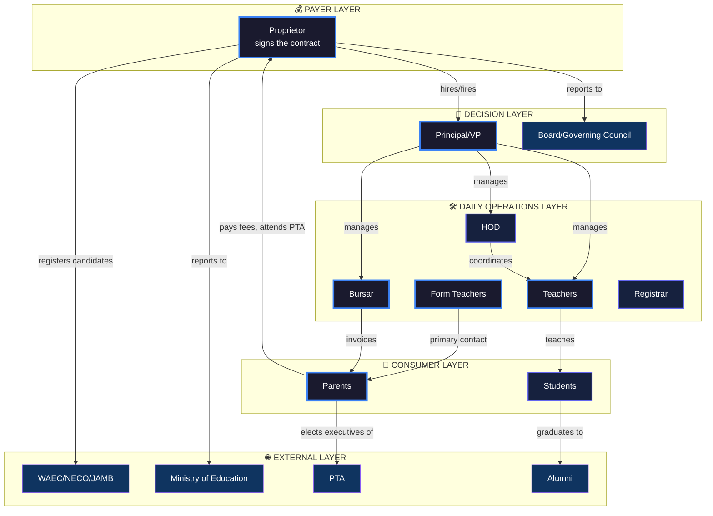
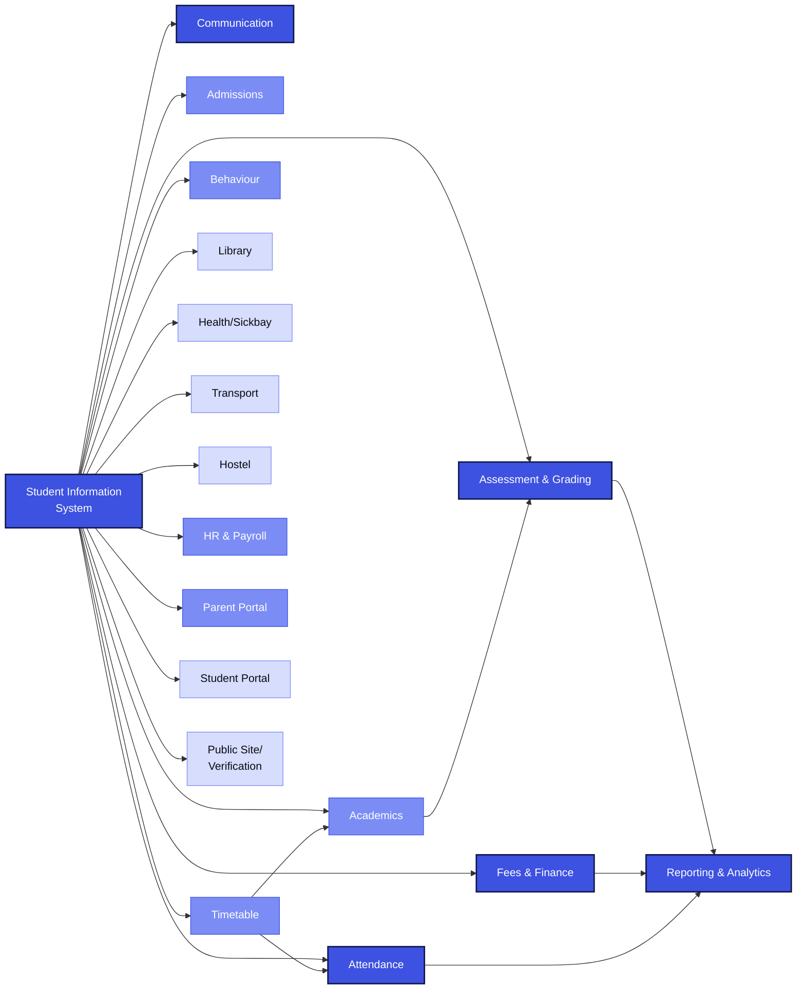
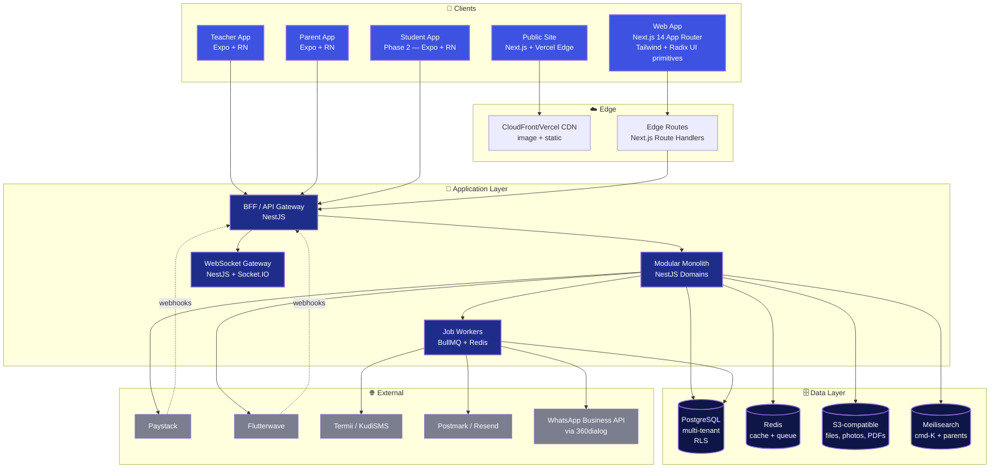
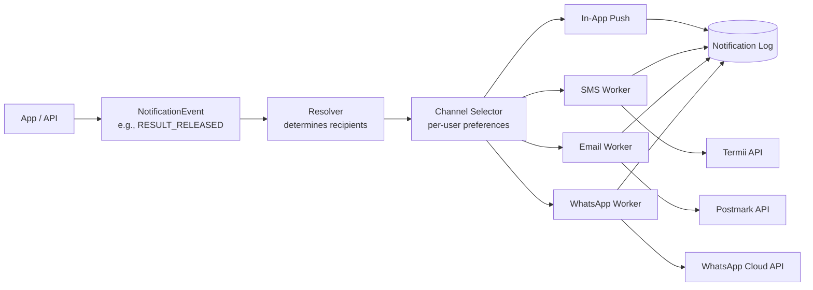

# myMakaranta.com — Product Requirements Document (v1)

**A school management platform for the Nigerian secondary education value chain, built with the craft standard of consumer-grade software.**

> *"Makaranta" is Hausa for "school." The name is deliberate: rooted in the largest single-language education market on the continent (Hausa is spoken across Northern Nigeria, parts of Niger, Cameroon, Ghana), and immediately legible as a Nigerian-built product without leaning on flag colors or kente patterns. The brand says: we are of this place, but we are not provincial.*

**Document type:** Product Requirements Document + Phased Execution Plan
**Audience:** Founder, founding engineering team, founding designer, prospective investors, prospective pilot schools
**Length:** ~15,000 words. Read in full before disagreeing.
**Status:** v1 — opinionated working document. Italicized blocks tagged `ASSUMPTION:` mark interpretive choices to validate before they harden into shipped code.

---

## Document map

- **Part 1** — Strategic Foundation (market reality, competitive landscape, positioning, constraints)
- **Part 2** — Stakeholder Value Map (eight personas, ranked, with anti-features)
- **Part 3** — Design System & Experience Principles (the wedge)
- **Part 4** — Functional Modules (seventeen modules, Nigeria-specific)
- **Part 5** — Technical Architecture (modular monolith, multi-tenant, offline-aware)
- **Part 6** — MVP Definition (12–16 weeks, surgical scope)
- **Part 7** — Phased Roadmap (months 0–14+)
- **Part 8** — Risks, Open Questions, Decisions That Cannot Be Deferred

---

# PART 1 — STRATEGIC FOUNDATION

## 1.1 Market reality check

Nigerian secondary schools are not under-served by software because operators don't want it. They are under-served because every existing product treats them as an afterthought to a generic "school SaaS" template, then bolts on Naira and a WAEC result template and calls it localized.

The actual operational reality, in concrete terms:

**Attendance is on paper.** A class teacher walks into JSS2C carrying a hardcover register. Names are written in long-hand at the start of term. At assembly, prefects mark themselves and their friends present. By Friday, the register has been "lost," "rained on," or simply forgotten in the staff room. Termly attendance counts are reconstructed from memory and rounded. The federal Unity Schools and serious mission schools do this slightly better; state schools and small private schools, which together educate the bulk of Nigerian secondary students, do this exactly as described.

**Continuous Assessment (CA) scoring is fragmented across teachers' personal notebooks, then collated by hand at the end of each term.** A subject teacher carries a softcover with column headings drawn in pencil. CA1 (out of 10), CA2 (out of 10), CA3 (out of 10), Exam (out of 70). These get added on a calculator the night before the form teacher's deadline. Errors are routine and largely invisible. When a parent disputes a child's result, the teacher's only defense is the softcover.

**Report card production is the single most painful event of every term.** In a typical 800-student private school, the form teacher of every class manually transcribes scores from subject teachers' submissions into a class master sheet, then into individual student report cards (often pre-printed, often photocopied). Position-in-class is calculated by hand. The principal signs each one. The vice-principal stamps each one. Errors propagate. The school holds parents' release of report cards until outstanding fees are paid — meaning a student with an A1 in Mathematics waits two weeks for the celebration because their father is owing ₦80,000 on third-term fees.

**Fee collection is bank-deposit-and-bring-the-teller.** Parents queue at GTBank, FirstBank, or Zenith with hand-printed school account details. They deposit cash, get a teller, photograph it, send it on WhatsApp to the bursar, and pray it gets reconciled before their child is sent home. The bursar maintains a parallel Excel sheet that is the actual source of truth, which the proprietor cannot see in real time.

**PTA meetings are mandatory and largely unattended.** Schools rely on PTAs for capital expenditure (buses, generators, building extensions) but have no instrumented way of tracking attendance, dues, contributions, or follow-through. A parent who hasn't paid PTA dues since 2023 is structurally invisible.

**Communication is WhatsApp Broadcast Lists.** The school owns one or two phone numbers. Parents are added to broadcast lists. Important announcements (closure due to security alert, exam schedule change, school fee deadlines) go out as WhatsApp messages with no read receipts at the school's end, no delivery guarantee, no archival, and no permission model. The principal cannot tell a board member which parents received the closure notice.

**WAEC, NECO, and JAMB registration is a manual data dump.** SS3 form teachers compile candidate data on Excel sheets in the format WAEC's online portal demands, send it to the school's exam officer, who then re-types it into the WAEC site. A misspelled name on the WAEC certificate is a permanent stain on a student's life — the corrections process takes months and money.

**Inspections from the Ministry of Education arrive without warning and demand records that don't exist in retrievable form.** A state schools-inspectorate officer asks for the past three terms of CA records for SS2A. The principal's first move is to call every form teacher who taught SS2A across those terms — half of whom have left the school.

**Behaviour records are the form teacher's memory plus their black book.** A student who repeatedly misbehaves in JSS1 can transition to a new form teacher in JSS2 with a clean slate, because the data was in a notebook on a desk that got cleared.

**Library books circulate via signed paper card systems.** Books are lost. Restocking decisions are made by guesswork. Reading habits are not visible.

**Sickbay records are a wall calendar with student names scrawled in.** When a child has a recurring health issue across terms, no one knows.

**Hostels (in boarding schools) operate on tribal knowledge.** Bed allocations, dorm prefects, lights-out compliance, weekend exeats, and visitation logs live in the hostel master's head and a couple of A4 pads.

**Transport (school buses) operates on driver memory.** Routes are not optimized; pickups depend on the driver remembering Tunde lives off Allen Avenue near the GT Bank.

The aggregate effect: Nigerian secondary schools spend an estimated 30–40% of administrative labor (`ASSUMPTION:` derived from operator interviews and adjacent-market studies — to be validated quantitatively in pilot) on tasks that are paper-replaceable, error-prone, and produce no leverage. Teachers spend evenings doing transcription that adds zero pedagogical value. Proprietors run multi-million-naira businesses with end-of-term financials they cannot see in real time.

This is not a software gap. This is a *crafted-product* gap. The schools have tried "going digital" — most have a half-abandoned Edves or SAFSMS account, a registrar who got trained once, and a teacher who refuses to use it because it crashes on her Tecno Camon.

## 1.2 Competitive landscape

Five categories of incumbents. None of them lose on capability; most lose on craft.

**SAFSMS (School Activity and Financial System Management Solution)** — Flexisaf-built, Abuja-headquartered, the most-known mid-market Nigerian SMS. Capability-broad: attendance, results, fees, communication. Visually a 2014 Bootstrap dashboard. Type stacks. Tables that scroll horizontally on mobile. The mobile app (where it exists) is a webview wrapper. Teachers describe the gradebook as "you click and click and the page reloads and you lose your row." Proprietors describe the financial reports as "I can export the Excel but I can't *read* it on the screen." Adoption is wide but shallow — most schools use ~30% of the feature surface and abandon the rest.

**Edves** — Lagos-headquartered, more aggressively marketed, slightly more polished UI than SAFSMS, still firmly in 2017-era enterprise SaaS aesthetic. Reasonable feature breadth. Same fundamental issue: every screen feels like it was designed by an engineer who had to ship, not by a designer who had to delight. Loading states are spinners. Forms are vertical stacks of inputs with grey borders. The mobile experience is acceptable but not desired.

**Schoolable** — Smaller, more boutique, slightly better visual sense than SAFSMS or Edves, but limited feature depth and a tiny customer base. Often deployed in single-proprietor schools where the proprietor personally onboarded it.

**Flexisaf-style enterprise plays** — Aim at universities and federal-grade institutions. Different price point, different sales motion, not directly competitive at the secondary level but worth noting because they set the price expectation in stakeholders' minds.

**International imports (Edmodo, Google Classroom, Microsoft for Education)** — Adopted in elite Lagos/Abuja private schools as classroom-collaboration tools, not as schools-of-record. Do not handle Nigerian fee structures, WAEC report card formats, or the school↔parent communication patterns Nigerian parents expect. Most schools that adopt these run them *alongside* a Nigerian SMS, not instead of one.

**The shadow incumbent: WhatsApp + Excel.** This is the actual market leader. WhatsApp for parent comms, Excel for fees and grades, paper for attendance, the principal's brain for everything else. Any product launching into this market is competing first against this shadow stack — not against SAFSMS.

The structural gaps:

| Gap | Where incumbents fail | Where myMakaranta wins |
|---|---|---|
| **Visual craft** | Bootstrap-era enterprise aesthetic, dense tables, hostile forms | Linear/Stripe-class density, Notion-class softness, mobile-first polish |
| **Mobile experience** | Webview wrappers, slow on Tecno-class devices | Native Expo apps, performance-budgeted for low-end Android |
| **Offline** | Fails completely without connectivity | First-class offline-aware sync (attendance, CA scoring) |
| **Stakeholder breadth** | Built for admins, neglect students/teachers/parents | Distinct purpose-built apps per stakeholder, all crafted |
| **Fees & reconciliation** | Bank-deposit upload, manual matching | Native Paystack, real-time reconciliation, parent-side receipt |
| **Report card design** | Photocopy-grade A4 tables | Designed showpiece — parent screenshots and shares it |
| **Communication** | Bolt-on email + SMS | Native in-app + SMS fallback + WhatsApp Business API integration |
| **Onboarding** | Multi-day training, manual data entry | Bulk import from Excel, supplier-side verification, < 2 weeks to live |
| **Brand & marketing** | Text-heavy reseller-style websites | Premium consumer-grade marketing site, conversion-optimized |

The pattern: incumbents win on familiarity, lose on every dimension that compounds over time. A school that adopts an incumbent today will tolerate it for 18 months and then quietly look for an alternative when the proprietor's daughter shows them Notion.

## 1.3 Positioning thesis

myMakaranta is the first Nigerian school management platform built to the craft standard of the consumer products its users open every other hour of the day. The wedge is not feature breadth — incumbents already have feature breadth. The wedge is that the proprietor's analytics dashboard feels like Linear, the parent's fee-payment confirmation feels like Cash App, the student's results page feels like Spotify Wrapped, and the teacher's gradebook feels like a spreadsheet that loves them back. We win because the next generation of Nigerian school proprietors — the daughters and sons taking over their parents' schools, the new founders building from scratch — will choose us on sight, before they read a feature comparison. And once we're in, we're sticky: every additional stakeholder we delight (teacher, parent, student, bursar) is a constituency that defends us when the proprietor's brother-in-law tries to recommend SAFSMS at the next board meeting.

## 1.4 Constraints and design principles for the Nigerian context

These are non-negotiable framing constraints. Every product decision in the rest of this document reflects them.

**Connectivity is intermittent and expensive.** Most pilot schools sit on 4G with shared data bundles. Data is bought in 1.5GB bundles for ₦1,500. A page that loads 5MB of JavaScript on first visit is *literally* charging the user money. **Design principle:** Performance budget is sacred. Initial JS payload ≤ 200KB gzipped. Images served via responsive `srcset` and AVIF/WebP. The marketing site must hit Lighthouse Performance ≥ 95 on mid-range Android.

**Power is intermittent.** A teacher entering CA scores at 7pm on a Sunday should be able to lose power for 90 minutes mid-session and resume without losing a single keystroke. **Design principle:** Optimistic local-first writes for high-frequency teacher and student flows. Sync on reconnect. Show the offline state clearly, never hide it.

**Devices skew low-end Android.** Tecno Spark, Infinix Hot, itel, second-hand Samsung J-series. 2–4GB RAM, 32–64GB storage, often near-full. **Design principle:** Mobile bundles must run on a 2GB-RAM device with no perceptible jank. No 60fps Lottie animations on critical paths. Skeleton screens, not spinners. Image lazy-loading mandatory.

**Payment rails are Naira, settled in Naira.** Schools collect fees in NGN. Teachers' salaries are paid in NGN. The platform's pricing is denominated in NGN initially. **Design principle:** Currency is a country-configurable primitive from day one — never hardcode "₦". The product must be ready for GHS, KES, and ZAR without a refactor. Payment provider is Paystack-primary, Flexisaf-style escrow not required.

**Identity is country-configurable.** In Nigeria, NIN and BVN are increasingly common identifiers. In Ghana, Ghana Card. In Kenya, Huduma Namba / national ID. **Design principle:** Identity verification is pluggable. Never type `nin: string` on the User model — it's `nationalIdValue: string` with an associated `nationalIdType: enum`.

**Trust is built through visibility, not features.** A Nigerian proprietor who has been burned by a vendor will trust you because you showed them, transparently, every fee paid by every parent in the past 24 hours — not because you sent a glossy quarterly report. **Design principle:** Every screen must be auditable. Every action must have a clear "who, when, what" trail accessible to the proprietor.

**Language is a layer, not a localization line item.** English is the language of instruction in Nigerian secondary schools, but parents may be more comfortable in Hausa, Yoruba, Igbo, or Pidgin. **Design principle:** The parent app and SMS communications are i18n-ready from MVP, even if only English ships first. The student app remains English-only to mirror the school environment.

**Bureaucracy is a feature, not a friction to be designed away.** WAEC report card formats, Ministry inspection records, PTA financial reporting — these are mandatory compliance artifacts that incumbent products treat as exports. **Design principle:** Compliance outputs are first-class. The WAEC-format result sheet, the NSC-format certificate of conduct, the Ministry-format termly returns — all are designed deliberately, not auto-generated.

**Schools buy on relationships and adopt on inertia.** A pilot school does not switch in three months because of features. They switch over a school year because they trust the people. **Design principle:** Onboarding and customer success are part of the product, not a department. The product must scaffold its own adoption — guided checklists for the principal, automated parent invitations, daily teacher nudges.

---

# PART 2 — STAKEHOLDER VALUE MAP

## 2.1 Stakeholder ranking and roles

Not every stakeholder gets equal weight. Here is the ranking, with explicit role classification:

| Stakeholder | MVP Tier | Role | Notes |
|---|---|---|---|
| **Proprietor / School Owner** | Tier 1 | **Payer, Decision-Maker, Influencer** | Signs the contract. Demands financial visibility. Will champion or kill internally. |
| **Principal / Vice Principal** | Tier 1 | **Gatekeeper, Power-User** | Approves the day-to-day. Signs report cards. Their endorsement makes adoption real. |
| **Form Teacher / Subject Teacher** | Tier 1 | **Daily Operator, Adoption Risk** | If they don't use it daily, the system fails. Highest churn risk if UX is hostile. |
| **Parent / Guardian** | Tier 1 | **Willingness-to-Pay Lever, Word-of-Mouth Channel** | Pays fees. Talks to other parents. Their experience drives proprietor renewal. |
| **Bursar / Accountant** | Tier 1 (light) | **Power-User (Finance Module)** | Daily user but narrow scope. Must love the fees module. |
| **Student** | Tier 2 (lean MVP, full Phase 2) | **End-User, Future Champion** | Lean MVP presence; full first-class app in Phase 2. The next generation of buyers. |
| **HOD (Head of Department)** | Tier 2 | **Power-User (Academics)** | Curriculum oversight. Academic quality assurance. |
| **Registrar** | Tier 2 | **Power-User (Admissions)** | Admissions and records management. |
| **Librarian** | Tier 3 | **Single-Purpose User** | Library module only. Phase 2. |
| **School Counsellor / Nurse** | Tier 3 | **Single-Purpose User** | Wellbeing & sickbay records. Phase 2. |
| **Board / Governing Council** | Tier 3 | **Quarterly Consumer of Reports** | Read-only dashboard. Phase 3. |
| **External: WAEC/NECO/JAMB Officer** | Tier 3 | **Compliance Touchpoint** | Export-only integration. Phase 3. |
| **External: Ministry Inspector** | Tier 3 | **Compliance Touchpoint** | Read-only audit access. Phase 3. |
| **External: PTA Executive** | Tier 3 | **Influencer** | PTA dues, attendance, comms. Phase 2 / 3. |
| **External: Alumni** | Tier 4 | **Future Network** | Alumni portal in Phase 4. |

Stakeholder relationship map:



The arrows are causal: Proprietor authority flows down; consumer experience flows up. We design for both directions.

## 2.2 Tier 1 stakeholders — deep treatment

### 2.2.1 The Proprietor

The proprietor is typically the school's founder or the founder's heir. In small private schools (1–3 schools, < 1500 students), the proprietor is hands-on — they show up unannounced, they know the JSS3 students by name, they review the term-end financials personally. In larger groups (5+ schools, 5000+ students), the proprietor runs a holding structure and views the schools as a portfolio.

**Job-to-be-done:** *Run a profitable, reputation-safe school, with full visibility into operations and finances, without having to be physically present every day.*

**Current pain points:**
- End-of-term financial reports arrive 2–3 weeks late, hand-collated by the bursar
- Parent complaints reach them via WhatsApp — they have no structural way to monitor parent sentiment
- Staff performance is anecdotal — no data on which teachers are consistently late, which classes are underperforming, which subjects have grade drift
- Capital decisions (new building, new bus, new sports field) are made on gut feel because there's no enrollment trend data
- No comparative view across multiple schools they own

**Top user stories:**
1. As a proprietor, I want to open the platform on Sunday morning and see one screen that tells me my school's health this week, so that I can decide where to focus my Monday.
2. As a proprietor, I want to see real-time fee collection status across all classes, so that I know our cash position before I commit to a new bus purchase.
3. As a proprietor, I want to compare academic performance across my three schools by subject and term, so that I can identify which schools need intervention.
4. As a proprietor, I want to be auto-notified when a parent submits a complaint or a teacher exceeds an absence threshold, so that I don't find out at the AGM.
5. As a proprietor, I want to share a beautiful end-of-term performance summary with my board, so that governance feels like governance, not a fire drill.
6. As a proprietor, I want to export Ministry-of-Education-compliant termly returns in one click, so that inspections feel routine.
7. As a proprietor, I want a public-facing school profile page (for prospective parents) that auto-updates with our enrollment, results, and recent achievements, so that admissions has marketing leverage I don't have to think about.

**Aha moment:** The first time they open the proprietor dashboard on a Sunday morning and see — at a glance — fees collected this week, attendance rate, top-performing class, and a quiet alert that JSS2 has a 3-day attendance dip. *That moment is when they tell their proprietor friend at a wedding the next weekend.*

**Anti-features:**
- Do not give them tactical UI (e.g., direct attendance entry, direct CA scoring). They will not use it; it dilutes the product's perceived sophistication.
- Do not surface raw exports. They want curated views, not Excel dumps.
- Do not force them to log in to mobile to do anything they could do on a laptop with coffee.

**Engagement model:** Weekly deep dive (laptop, Sunday or Monday morning, premium screen real estate). Daily glance (mobile, while driving or in a meeting). Quarterly board prep (laptop, polished export).

**Design considerations:** *Linear-class.* Dense but never cluttered. Command-K palette for power navigation. Dark mode preferred (matches their other tools — Notion, Linear, Slack). Numerical clarity is paramount — tabular figures, real currency formatting, no abbreviations (`₦12,450,000` not `12.45M ₦`). The dashboard is the product's *selling room* — it must be the most beautifully crafted screen in the entire platform.

### 2.2.2 The Principal / Vice Principal

**Job-to-be-done:** *Run the school day-to-day — discipline, academics, operations — and make the proprietor's dashboard look good without spending evenings transcribing data.*

**Current pain points:**
- Form teachers submit class results late; the principal personally chases them
- Discipline cases get re-litigated because the previous form teacher's records are gone
- WAEC registration for SS3 is a manual exercise that consumes a week of life
- Inspections from the Ministry require pulling records that don't exist in retrievable form
- No structured way to identify which teachers are consistently absent

**Top user stories:**
1. As a principal, I want a single dashboard showing class-by-class status (attendance, results submitted, fees paid), so that I know who to call into my office today.
2. As a principal, I want to electronically sign and release report cards in batch, so that the end-of-term release isn't a four-hour signing marathon.
3. As a principal, I want to view a student's complete history (academic, behaviour, attendance, health) on one screen, so that parent meetings feel informed.
4. As a principal, I want to assign teachers to classes and subjects with one drag-and-drop, so that timetable adjustments mid-term don't break my Saturday.
5. As a principal, I want to send an emergency announcement to all parents and staff in three taps, so that the WhatsApp scramble for security alerts ends.
6. As a principal, I want to see staff attendance and lateness patterns at a glance, so that performance reviews are evidence-based.
7. As a principal, I want to generate a Ministry-compliant termly return in one click, so that inspections aren't a fire drill.

**Aha moment:** The end-of-term report card release. Principal opens the report-card review screen, sees all 23 form teachers' submissions ranked, reviews flagged anomalies (any score outside expected distribution), batch-signs, and triggers parent release with one tap. *Three hours of work becomes fifteen minutes.* They walk into the staff room and tell the form teachers.

**Anti-features:**
- Do not give them deep tactical entry screens (CA scoring, direct attendance). Those are teacher screens; surfacing them muddles the principal's mental model.
- Do not require them to remember a separate password from the proprietor's account hierarchy.
- Do not auto-publish anything sensitive (results, fees, comms) without their explicit "release."

**Engagement model:** Daily desktop usage (school laptop, in the principal's office). Mid-day mobile checks. Heavy usage at end-of-term (peak load).

**Design considerations:** Pragmatic, dense, fast. Closer to a power-user enterprise tool than the proprietor's curated dashboard. Keyboard shortcuts everywhere. Bulk actions are first-class. Light mode preferred (the principal's office has fluorescent lighting; dark mode causes glare). Sensible defaults — release window for report cards is preset; the principal customizes only when they want to.

### 2.2.3 The Teacher (Subject + Form)

The teacher is the make-or-break stakeholder. If teachers don't use the system *daily*, every other promised value evaporates. They are also the most undervalued stakeholder in incumbent products — given hostile interfaces, judged for non-adoption, blamed when the data is wrong.

**Job-to-be-done:** *Mark attendance, record CA scores, plan and deliver lessons, and communicate with parents — without my evening or weekend being consumed by transcription work.*

**Current pain points:**
- Manual register copying (twice a day for form teachers)
- CA scores recorded in personal notebooks, transcribed at end-of-term under deadline pressure
- Parent communication is via personal WhatsApp (boundary issues, no archival, mixed personal/professional)
- Lesson notes recopied each year
- Schemes of work are mismatched between teachers teaching the same subject in parallel classes
- No way to track individual student progress across terms — it's a memory game

**Top user stories:**
1. As a subject teacher, I want to mark attendance in 30 seconds via a tap-to-toggle student grid on my phone, so that I reclaim the first ten minutes of class.
2. As a subject teacher, I want to record CA scores during class with autosave, so that I never have to "do my CAs" on Sunday night.
3. As a form teacher, I want to see my class roster with one-tap profiles (parent contact, fee status, recent attendance, recent grades), so that I'm prepared for any parent call.
4. As a teacher, I want to message a parent within the platform — with the school's identity, not my personal number — so that my private WhatsApp stays private.
5. As a teacher, I want to import last term's lesson notes and edit, so that I'm not retyping every year.
6. As a teacher, I want to flag a student of concern (academic, behavioural, emotional) for the counsellor to follow up, so that issues don't fall through the cracks.
7. As a teacher, I want to see a calendar of upcoming CAs, exams, and submissions, so that I'm never blindsided by a deadline.
8. As a teacher, I want offline-mode to keep working when WiFi or 4G drops mid-class, so that the system never costs me class time.

**Aha moment:** First Friday of the first term using myMakaranta. They come home, sit down, and realize — for the first time in their teaching career — there is no "weekend grading session" to do. The CAs are entered. The attendance is entered. They open Netflix instead. *They tell every teacher in the staff room on Monday.*

**Anti-features:**
- Do not require teachers to enter scores via a desktop. Most teachers' primary device is their phone.
- Do not gamify teaching with points or badges. It's condescending.
- Do not surface aggregate analytics to teachers in a way that feels like surveillance. Anonymized class trends, yes; "you scored 3.2/5 on parent satisfaction this week," absolutely not.
- Do not make them learn a new vocabulary. "CA1, CA2, CA3, Exam" — not "Continuous Assessment Component 1." Match their language.

**Engagement model:** Multiple times a day, on phone, in the classroom. Occasional desktop use (lesson note authoring, end-of-term reflections). Heavy use at end-of-term.

**Design considerations:** *Mobile-first, thumb-zone-optimized, forgiving.* Undo everywhere. Optimistic UI everywhere — never make a teacher wait. Large tap targets (minimum 44px, 48px preferred). Generous typography (the staff room is dim, teachers are tired). Color-coded student tiles (present/absent/excused/late). Keyboard-friendly score entry (numeric keyboard with explicit `Next` key, never trapping focus). Haptic feedback on every save. The interface should *feel* like the product respects their time — because the only way teachers adopt is if they feel respected.

### 2.2.4 The Parent / Guardian

**Job-to-be-done:** *Stay informed about my child's education and wellbeing without having to chase the school, and pay fees without queuing at a bank.*

**Current pain points:**
- Late or never-arriving report cards (held for unpaid fees, lost in transit, transcription errors)
- Bank queue for fee payment, then WhatsApp reconciliation chase
- WhatsApp broadcast lists missed because of phone changes, full storage, etc.
- No visibility into daily school life — they hear "school was fine" from a JSS1 boy and that's it
- PTA dues paid in cash, with no receipt that survives a wallet change
- Multiple children at the same school = parallel mental tracking

**Top user stories:**
1. As a parent, I want a single home screen that shows me each of my children, with their most recent attendance, results, and announcements, so that I'm never the last to know.
2. As a parent, I want to pay fees via Paystack from my couch with one tap, with an immediate receipt, so that bank queues are over.
3. As a parent, I want to receive a beautifully-designed end-of-term report card on my phone the moment it's released, so that I can celebrate or address it the same day.
4. As a parent, I want to message my child's form teacher directly — not via my personal WhatsApp — so that the conversation is on record and within school boundaries.
5. As a parent, I want to confirm I've read important announcements (school closure, exam timetable, PTA meeting), so that the school knows I got it.
6. As a parent, I want to see my child's full academic trajectory across terms, so that I can identify trends, not just react to one bad result.
7. As a parent, I want to easily switch language to Hausa/Yoruba/Igbo for the parent app, so that the experience matches my comfort.

**Aha moment:** Receiving the term-end report card via the parent app — animated reveal, tasteful celebration, the child's photo on the cover, their CA history shown as a gentle line chart, the principal's digital signature. *Screenshotted, sent to the WhatsApp family group, becomes the school's best advertisement.*

**Anti-features:**
- Do not require email verification. Many parents share emails or don't check email at all. Phone-number-first identity.
- Do not make them "create a complicated password." Magic links via SMS or WhatsApp are the right floor.
- Do not bury fee payment under three menu levels. Fees are the parent's #1 use case after results.
- Do not surface academic comparisons across other students' families. Invasive.

**Engagement model:** 2–3 times a week on phone. Spike at end-of-term (results), end-of-month (fees due), and during emergencies. Occasionally on a laptop (during fee payment from work).

**Design considerations:** *Calm, reassuring, confidence-inspiring.* Soft typography. Generous whitespace. A child's photo as the visual anchor of every screen. Currency in clean tabular figures, never abbreviated. Fee status as a single, glanceable circle (paid / outstanding / overdue). Notifications are tasteful, not noisy — never more than one push per day from the school except in emergencies. Multilingual UI from MVP (English first; Hausa, Yoruba, Igbo, Pidgin queued for Phase 2).

### 2.2.5 The Bursar / Accountant

**Job-to-be-done:** *Reconcile fee payments daily, generate accurate financial reports for the proprietor, and never let a parent dispute a payment that the school has on record.*

**Current pain points:**
- Bank deposit reconciliation is a daily Excel exercise
- Parents claim "I paid" with a teller photo that's hard to verify
- End-of-term fee position is calculated by hand
- Refunds, scholarships, and discounts are tracked in side notebooks
- No audit trail when challenged

**Top user stories:**
1. As a bursar, I want all Paystack payments to auto-reconcile to the right student account, so that 80% of my reconciliation work disappears.
2. As a bursar, I want to upload a bank statement CSV for non-Paystack payments and match against expected fees, so that the residual 20% is tractable.
3. As a bursar, I want to issue a discount or scholarship with a written reason, signed off by the principal or proprietor, so that the audit trail is bulletproof.
4. As a bursar, I want to generate a real-time fee position report by class, term, and student status, so that the proprietor can ask any question and I have the answer in seconds.
5. As a bursar, I want to print or send a clean receipt for any payment, so that parents have proof they trust.
6. As a bursar, I want to flag bounced payments and overdue accounts with auto-reminders, so that chasing isn't my full-time job.

**Aha moment:** Closing a Friday afternoon with the fee reconciliation panel showing "All transactions reconciled. ₦4,328,500 collected. 0 unmatched." *That panel becomes the proof point they show every other bursar at the next bursars' association meeting.*

**Anti-features:**
- Do not let them edit a transaction after it's reconciled. Adjustments must be auditable counter-entries.
- Do not give them admin powers over non-finance modules.

**Engagement model:** Daily, on desktop, in the school office. Heavy at start- and end-of-term.

**Design considerations:** Spreadsheet-comfortable. Keyboard shortcuts for navigation. Inline editing of reasons. Tabular figures, right-aligned currency. Print-friendly layouts for receipts and reports. Light mode preferred.

## 2.3 Tier 2 stakeholders — focused treatment

### 2.3.1 The Student (lean MVP, full Phase 2)

**Job-to-be-done (MVP-lean):** *Know my schedule, see my results when they're released, read school announcements, and have a credible digital identity card.*

**Job-to-be-done (Phase 2 full app):** *All of the above, plus collaborate on assignments, message classmates and teachers within school boundaries, track my own progress, build a reading and learning streak, and feel that the school sees me as a person.*

**MVP user stories:**
1. As a student, I want to view my timetable with class locations, so that I'm never lost on a substitution day.
2. As a student, I want to see my results the moment they're released, so that I'm not waiting on a parent's mood.
3. As a student, I want to read school announcements in the same place my school sends them, so that I don't depend on a class WhatsApp group.
4. As a student, I want a digital school ID, so that I can access campus services without a plastic card.

**Aha moment (MVP):** Results day. The student opens the app to a beautifully designed reveal — gentle animation, their photo, their position, their subjects ranked, the principal's note. *They screenshot it. They send it to their class group. The school's brand spreads to schools that don't have us.*

**Anti-features:**
- Do not gamify in patronizing ways (badges, points, leaderboards by raw rank). Use streaks and progress sparingly.
- Do not allow public student-to-student chat in MVP — moderation cost too high. Phase 2 introduces structured collaboration only.
- Do not surface comparisons that humiliate (e.g., "you're 35th of 40 in class").

**Engagement model:** Daily on phone. Occasional desktop use for assignments (Phase 2). Spikes around results, exam schedule release, school events.

**Design considerations:** *Closer to a social/lifestyle app than enterprise software.* Identity-aware (the student's photo and name are visually anchoring). Snappy. Visual. Slightly playful — dynamic gradients, tasteful micro-interactions, sound design where it serves. The student app's tone is the future-Nigerian-consumer-product tone: confident, modern, *Nigerian* in subtle visual cues but not in stereotype.

### 2.3.2 The HOD (Head of Department)

**Job-to-be-done:** *Coordinate the subject teachers in my department, ensure curriculum coverage, monitor academic quality.*

**Top stories:**
1. As an HOD, I want to see scheme-of-work coverage progress per teacher, per class.
2. As an HOD, I want to compare CA score distributions across my department's classes for grade drift detection.
3. As an HOD, I want to approve or comment on lesson notes before they're delivered.
4. As an HOD, I want to be auto-flagged when a teacher hasn't entered grades for two weeks.

**Engagement model:** Weekly desktop, daily phone glance.

**Design considerations:** Mid-density. Light analytics. Approval workflows are the dominant interaction.

### 2.3.3 The Registrar

**Job-to-be-done:** *Manage admissions, transfers, withdrawals, and student records.*

**Top stories:**
1. As a registrar, I want to publish admissions forms with online application, so that paper queues end.
2. As a registrar, I want to score, shortlist, and admit candidates within the platform, so that the admissions cycle is auditable.
3. As a registrar, I want to issue a transfer certificate or testimonial in one click with a digital signature, so that requests don't pile up.
4. As a registrar, I want to maintain the official student record with versioning, so that name corrections and photo updates are traceable.

**Engagement model:** Heavy at admissions windows, light otherwise.

**Design considerations:** Process-driven. Step-by-step admissions wizard. Document templates with merge fields.

## 2.4 Tier 3 stakeholders — narrow treatment

### 2.4.1 Librarian (Phase 2 module)

JTBD: Track book inventory, lending, and reading patterns. Stories: bulk import the existing catalogue from Excel; lend via a barcode/QR scan; auto-remind on overdues; report on most-borrowed titles per class. Anti-feature: don't try to be Goodreads. Design: scanner-first mobile interface for lending.

### 2.4.2 School Counsellor / Nurse (Phase 2 module)

JTBD: Maintain confidential wellbeing and health records, track recurring patterns. Stories: log a sickbay visit in 30 seconds; flag a student for a follow-up; share an alert with parents privately; produce a termly wellbeing summary. Anti-feature: do not surface counselling notes to teachers or admin without explicit consent. Design: privacy-first information architecture; encrypted notes.

### 2.4.3 Board / Governing Council (Phase 3)

JTBD: Quarterly oversight without operational involvement. Stories: receive a polished quarterly report; review approval queue (capex, fee structure changes); audit trail access. Design: read-only dashboard, board-pack-grade visual quality.

### 2.4.4 External — WAEC / NECO / JAMB officer (Phase 3)

Touchpoint: an export endpoint that produces WAEC-format candidate registration files; receive results back into the platform. Design: format-compliant, tested against current WAEC schema.

### 2.4.5 External — Ministry Inspector (Phase 3)

Touchpoint: a read-only audit role with a time-bounded access link. Design: scoped permission, expiring link, watermarked exports.

### 2.4.6 External — PTA (Phase 2 module)

JTBD: Run PTA dues, attendance, financial transparency. Stories: pay PTA dues via Paystack; see PTA financial statement; RSVP for meetings. Design: separate visual identity within the parent app — "PTA" feels like its own thing, not subsumed by the school.

### 2.4.7 External — Alumni (Phase 4)

Phase 4 platform play: alumni portal, donations, mentorship matching. Design: standalone product, hub-spoke with main platform.

---

# PART 3 — DESIGN SYSTEM & EXPERIENCE PRINCIPLES

This is the wedge. Every other section assumes design quality is non-negotiable. This section defines what that means concretely.

## 3.1 Design Philosophy

Our design ethos draws from five reference products, each contributing a distinct attribute:

- **Linear** — keyboard-first density, command palette, dense data without clutter. Reference for the proprietor and admin web app.
- **Stripe** — financial data clarity, tabular figures, calm authority. Reference for fees, financial reports, the bursar.
- **Notion** — softness, content-as-canvas, flexibility without anarchy. Reference for lesson notes, schemes of work, communication.
- **Cash App** — radical simplicity in transactional moments. Reference for the parent's fee payment flow.
- **Arc** — playfulness without juvenility, considered motion, brand confidence. Reference for the student app and signature moments.

Translating these to a Nigerian secondary school context is not about importing aesthetics. It is about importing *standards of craft*. A teacher in Ibadan deserves an interface as considered as a designer in Lagos uses on Linear. A parent in Kano deserves a fee receipt as elegant as a Lagos creative gets from Cash App. The translation is in the *content* (Naira, WAEC formats, Hausa, Yoruba, Igbo) not the *standards* (typography, motion, hierarchy, restraint).

The design philosophy in one sentence: **Treat every screen as if a senior product designer at a top consumer company will see it tomorrow, because eventually one will.**

## 3.2 Brand Identity Direction

### 3.2.1 Wordmark and logo

The wordmark is `myMakaranta`, all-lowercase, with the subtle inflection that "Makaranta" carries weight. The mark uses a custom-cut wordmark based on the geometric sans (see typography below), with a single ligature between the *m* and *y* signaling intimacy. *No icon-mark for MVP.* A wordmark-only identity reads as confident and modern; an icon-mark forces a category-defining symbol decision that we should not make under launch pressure. We add an icon-mark in Phase 2 once the brand has been worn by real schools and a meaningful symbol has surfaced organically.

### 3.2.2 Typography

**UI typeface: Inter (Variable)** — Free, world-class Latin coverage, geometric clarity, screen-optimized at small sizes, supports tabular figures, supports Yoruba diacritics (e.g., ọ́, ẹ̀, ṣ). Inter is the new "default-and-defensible" choice; using it signals technical literacy without trying to be cute.

**Display / Marketing typeface: General Sans (ITF)** — Used on the marketing site, in-product hero moments (results day, term-end), and major typographic moments. Slightly more personality than Inter, still geometric, free for commercial use.

**Academic / Report card typeface: Newsreader (Google Fonts)** — A humanist serif designed for reading at length and printing. Used on the report card itself, certificates, transcripts. The serif gestures at academic gravitas without being stuffy.

**Numerics:** Inter with `font-feature-settings: 'tnum' 1` (tabular figures) for all financial and grade displays. Numbers must align column-to-column.

**Scale:** Modular scale of 1.25 (major third). Display 64/56, H1 40/40, H2 28/32, H3 20/24, body 16/24, small 14/20, caption 12/16. We tune for comfort, not density alone — readability on a 5.5" Tecno screen at arm's length is the floor.

### 3.2.3 Color system

**Defended POV:** We do not lean into Nigerian flag colors (green and white). They are the lowest-effort visual marker of "Nigerian product" and they look like an LGA secretariat. We also do not adopt a generic Bay Area neutral palette — that signals indifference to where we operate.

We anchor on **indigo blue** as the signature primary color. Indigo is culturally resonant across Nigerian textile traditions: Hausa indigo dye work in Kano, Yoruba adire in Abeokuta, Igbo nri indigo. It is pan-Nigerian without being cliché. It also reads as trustworthy, academic, and modern — the right semantic associations for a school product.

**Primary palette:**

| Token | Hex | Use |
|---|---|---|
| `brand-primary-50` | `#EEF1FF` | Tinted backgrounds, hover states |
| `brand-primary-100` | `#D6DDFD` | Subtle borders, soft fills |
| `brand-primary-300` | `#7B8DF5` | Accent text |
| `brand-primary-500` | `#3D52E0` | Primary buttons, links, brand surfaces |
| `brand-primary-700` | `#1F2D8A` | Pressed states, dark-mode primary |
| `brand-primary-900` | `#0E1547` | Logos on light backgrounds, deep accents |

**Accent palette: Saffron (cultural nod to Nigerian sun and academic gold without being literal):**

| Token | Hex | Use |
|---|---|---|
| `accent-saffron-100` | `#FEF3D9` | Celebration backgrounds (results day) |
| `accent-saffron-500` | `#E8A33C` | Highlight chip, achievement badge |
| `accent-saffron-700` | `#A06A1A` | Saffron text on light |

**Neutral palette (warm-leaning):**

| Token | Hex | Use |
|---|---|---|
| `ink-1000` | `#0A0B12` | Primary text on light, base canvas dark |
| `ink-700` | `#3A3D4A` | Secondary text |
| `ink-500` | `#7A7E8E` | Tertiary text, placeholder |
| `ink-300` | `#C7C9D1` | Borders |
| `ink-100` | `#EFEFF3` | Subtle backgrounds |
| `paper` | `#FAFAF7` | Base canvas light (warm off-white, not pure white) |

**Semantic palette:**

| Token | Hex | Use |
|---|---|---|
| `success-500` | `#1F9D55` | Fee paid, attendance present, on-time |
| `warning-500` | `#D97706` | Outstanding, late, action required |
| `error-500` | `#D02B2B` | Overdue, absent, blocking |
| `info-500` | `#2D7CE0` | Informational notices |

The palette is dark-mode-first-class. Each token has a documented dark-mode mirror; the `paper` background in dark mode is `#0E0F14`, not pure black, to reduce OLED smearing.

### 3.2.4 Iconography

**Foundation: Lucide.** Free, comprehensive, framework-agnostic, imported as standalone React components — no UI-library coupling. We use Lucide icons at 20px and 24px, 1.75px stroke weight, with consistent corner radius and join geometry.

**Custom layer:** A small set of myMakaranta-specific icons we draw ourselves — e.g., the *report-card seal*, the *PTA crest*, the *attendance check-in*, the *fee receipt*. These extend Lucide's visual language but encode product-specific concepts.

**Usage rule:** Filled icons are reserved for selected/active states. Default is line. We never mix filled and line in the same row.

### 3.2.5 Photography and illustration

**Photography:** Authentic Nigerian. We commission shoots in real Nigerian schools — JSS1 students in their actual uniforms, teachers in actual classrooms, parents at actual school gates. We refuse stock photos of generic "African students" — they look performative and our users will smell it instantly.

**Illustration:** A custom illustration system, built in-house, depicting a small cast of stylized Nigerian characters (the proprietor in agbada, the teacher in modest western/native blend, parents in casual modern, students in school uniform with realistic skin tones). Used sparingly on empty states, onboarding, and marketing. **Not** used to decorate functional UI — empty states are illustrated; dashboards are not.

We commission this illustration system from a Nigerian illustrator (`ASSUMPTION:` validated by founder relationships — to be sourced), not an outsourced studio. The illustrations carry forward into the brand long-term.

## 3.3 Interaction & Motion Principles

### 3.3.1 Motion language

- **Easing:** Default to `cubic-bezier(0.16, 1, 0.3, 1)` (custom "ease-out-expo"-ish curve). Linear motion is forbidden except for indeterminate progress.
- **Duration ranges:** Micro (80–140ms) for property toggles, hover states, focus rings. Standard (200–280ms) for page transitions, modal open/close. Hero (400–700ms) for signature moments only — results reveal, payment success.
- **When to be still:** Lists do not animate on initial render. Tables do not animate on sort. Numbers do not animate on update unless the user just triggered the update. **Animation must serve communication, not decorate.**
- **Library:** **Framer Motion** for web (best DX, great low-end performance with `LazyMotion` and `domAnimation`). **React Native Reanimated 3** for mobile (runs animations on the UI thread, cheap on Tecno-class devices).

### 3.3.2 Micro-interactions philosophy

Every meaningful action gets a small, considered confirmation. Saving a grade scales the cell briefly to 1.02 and pulses a faint success tint. Marking attendance present pulls the student tile inward 2px and shifts the chip to green. Paying a fee animates a checkmark draw and shows a bottom-sheet receipt. **The interaction is the receipt** — it tells the user, in one frame, that the system heard them.

### 3.3.3 Loading and empty states

- **No generic spinners.** Skeleton screens for above-the-fold content. Inline progress for long operations (bulk import, end-of-term release).
- **Empty states are illustrated and useful.** Every empty state names the situation, suggests a next action, and uses the illustration system. ("No CA scores yet — Add scores for SS2A?" with the teacher-illustration character holding a clipboard.)
- **Error states are direct.** "Network dropped — your last 3 changes are saved locally and will sync when you're back online." Never "Something went wrong."

### 3.3.4 Optimistic UI

For high-frequency actions (attendance toggle, score entry, message send, fee payment initiation), we update the UI immediately and reconcile in the background. On failure, we show a non-blocking toast with `Retry` and revert. **Wait-state is the enemy of teacher adoption.**

### 3.3.5 Haptics

Every meaningful tap on mobile produces haptic feedback. We use `Haptics.notificationAsync` for confirmations, `Haptics.selectionAsync` for picker changes, `Haptics.impactAsync({style: 'light'})` for tile toggles. **The phone responds even when the network doesn't.**

### 3.3.6 Sound

Optional, off by default. Two sounds: a soft chime on result release (Phase 2) and a gentle confirmation tone on fee payment (parent app). User-configurable. We do not auto-play sound.

## 3.4 Information Architecture & Navigation

### 3.4.1 Per-platform paradigms

- **Proprietor / Admin web app:** Sidebar (collapsible to icon rail) + command palette (`⌘K` / `Ctrl+K`). The command palette is the primary navigation aid — every action, every entity, every page is one keystroke away.
- **Teacher mobile app:** Bottom tab bar (5 tabs: Today, Classes, Messages, Tools, Me). FAB-free; primary actions live in context.
- **Parent mobile app:** Bottom tab bar (4 tabs: Home, Children, Pay, Messages). Generous, calm.
- **Student mobile app (Phase 2):** Bottom tab bar (5 tabs: Today, Classes, Results, Library, Me). Closer to a social app pattern.
- **Marketing site:** Top nav. Conversion-focused.

### 3.4.2 Search-first philosophy

The proprietor and principal web apps are command-palette-first. Pressing `⌘K` from anywhere opens a unified search across students, teachers, classes, fees, announcements, and recent actions. Result types are color-chipped. Selecting a result navigates to the canonical entity page. The command palette is also the action launcher — `New > Announcement`, `Generate > Termly Return`.

### 3.4.3 Density modes

A teacher's gradebook is dense by necessity. A parent's dashboard is sparse by intention. **Density is a per-stakeholder design choice, not a global toggle.** We do not offer "comfortable / cozy / compact" settings — that's an admission that we couldn't decide. We decided.

## 3.5 Component Library Approach

**Foundation: pure Tailwind CSS, no component library.** We do not use shadcn/ui, MUI, Chakra, Mantine, or any pre-built component system. Every component in the codebase is built in-house. This is a deliberate, defended choice.

**Why no component library:** Every off-the-shelf system carries a baked-in aesthetic — shadcn's neutral grey-100 vibe, MUI's Material weight, Chakra's earnest defaults. Each one fights the craft ambition described throughout this document. Inheriting an aesthetic, even one we plan to override, is a tax we pay every time we touch a component. Building from primitives is a 2–3 week upfront investment that returns design freedom for the lifetime of the product.

**For accessibility-heavy interactive primitives — Radix UI (headless).** Re-implementing focus traps, ARIA roles, keyboard navigation for combobox / dialog / tabs / menu / tooltip / popover from scratch is a six-month detour with regression risk. Radix UI ships these as **unstyled, behavior-only primitives** — exactly what we need. We import `@radix-ui/react-*` for `Dialog`, `Popover`, `Select`, `Tabs`, `Tooltip`, `Toast`, `Switch`, `Dropdown`, `Accordion`, `RadioGroup`, `Checkbox`, `NavigationMenu`, `Avatar`. We style them entirely with Tailwind. Radix gives us a11y; we own everything else.

**Composition stack:**
- `tailwindcss` v3 (with portable token model so v4 migration is mechanical, not a rewrite)
- `class-variance-authority` (cva) — variant definitions, ~2KB, no aesthetic opinions
- `tailwind-merge` — class deduplication when composing
- `@radix-ui/react-*` — headless primitives (only for non-trivial behavior + a11y)
- `lucide-react` — icons

For purely visual elements (Button, IconButton, Input, Textarea, Card, Tag, Chip, Avatar, Badge, Skeleton, EmptyState, ErrorState), we write everything from scratch with Tailwind. No primitive library underneath.

**Token layer:** A `tokens.ts` module exports design tokens (color, spacing, type scale, radii, shadows, motion durations). The Tailwind config consumes `tokens.ts` so there is one source of truth. Components reference tokens via Tailwind classes (`bg-brand-primary-500`, `rounded-card`, `motion-standard`) — never raw hex codes, never magic numbers.

**Naming convention:** Compound-component pattern, written ourselves. `Dialog`, `Dialog.Trigger`, `Dialog.Content`, `Dialog.Header`, `Dialog.Footer`. Composition over prop-drilling. We re-export Radix primitives under our own component names so the rest of the codebase never imports `@radix-ui/*` directly — Radix is a dependency, not a dependency-of-dependencies.

**Dark mode:** First-class. Every token has a `light` and `dark` variant. We use Tailwind's `class` dark-mode strategy with `class="dark"` on the html element. User-controlled via a settings switch; OS-default-aware.

**Foundational components (sprint 0–1, before feature work):** ~25 components — Button, IconButton, Input, Textarea, Select, Checkbox, Radio, Switch, Tag, Chip, Avatar, Badge, Card, Dialog, Sheet, Drawer, Tooltip, Popover, Toast, Tabs, Accordion, Dropdown, Skeleton, NavigationMenu, BreadcrumbNav, EmptyState, ErrorState. Engineering investment: 2–3 weeks for two engineers paired with the founding designer. **This work happens before feature sprints begin and is non-negotiable.** The MVP timeline (§7) accommodates it.

**Accessibility floor:** WCAG 2.2 AA. All interactive elements meet 4.5:1 contrast. Tap targets 44x44px minimum. Focus rings are 2px, indigo, with 2px offset. Screen-reader labels on every icon button. Tested on TalkBack (Android) and VoiceOver (iOS). Radix delivers focus traps, escape handling, focus restoration, and ARIA roles for the components it covers; we hand-roll a11y for the components we build from scratch and audit weekly.

**Outdoor-readability consideration:** Nigerian sunlight on a phone screen at noon is a real WCAG context. We bump our contrast floor on text-on-image surfaces to 7:1 (AAA). The result-card image overlay, the school-logo overlay, the marketing hero — all 7:1 minimum.

## 3.6 Mobile Design Principles

### 3.6.1 Performance budget

- **JavaScript bundle:** First-load mobile bundle ≤ 200KB gzipped (web). React Native bundle ≤ 8MB initial.
- **Time to interactive:** ≤ 3s on a 4G connection, mid-range Android.
- **Animation budget:** No more than 3 simultaneous Reanimated animations on a single screen on a Tecno Spark device. We test on a real Spark, not a Pixel emulator.
- **Image budget:** ≤ 200KB per visible image. AVIF preferred, WebP fallback. `srcset` everywhere.

### 3.6.2 One-handed reachability

The student and parent apps assume one-handed use (the other hand is holding a child, a schoolbag, or driving to school pickup). Primary actions sit in the bottom 60% of the screen. The top 40% is the visual hero zone — child's photo, summary card, latest result.

### 3.6.3 Thumb-zone optimization

Critical actions (Pay Fees, Mark Attendance, Send Message) live within 75px of the bottom of the screen. Destructive actions (Delete, Discard) are top-right and require confirmation. **Never put a destructive action in the thumb zone.**

### 3.6.4 Skeleton screens

Skeleton screens for any content that takes > 200ms to load. The skeleton matches the final layout exactly — same paddings, same dimensions. The user perceives speed even on slow networks.

### 3.6.5 Offline-first design

Offline is not a degraded mode. It is the *normal mode* for high-frequency teacher and student actions. The offline state is named ("Working offline — 4 changes pending") but never shaming. The sync, when it happens, is silent unless there's a conflict.

## 3.7 Stakeholder-Specific Design Treatments

### 3.7.1 Student app

Tone: confident, modern, identity-aware. The student's photo and name are visually present on every primary screen. Results are celebrated with restraint. The visual language borrows from Spotify (color-rich, photographic, dynamic) and Arc (playful but considered). Key screens: the home (schedule, recent results, upcoming events), the results reveal (signature moment), the digital ID card (a small, highly polished card screen).

### 3.7.2 Parent app

Tone: calm, reassuring, confidence-inspiring. The child's photo anchors every screen. Currency in clean tabular figures. Fee status as a single circle. Notifications tasteful, not noisy. Multilingual UI. Key screens: the multi-child home, the fee payment flow, the report card delivery, the form-teacher conversation.

### 3.7.3 Teacher app

Tone: efficient, forgiving, fast. Mobile-first. Undo everywhere. Optimistic UI. Numeric keyboards optimized. Color-coded student tiles. Generous tap targets. Key screens: the today view (today's classes, attendance prompts, pending CAs), the class roster, the score entry grid, the parent messaging panel.

### 3.7.4 Admin / Proprietor web app

Tone: dense, authoritative, command-palette-driven. Linear-class. Dark mode default for the proprietor. Numerical clarity paramount. Key screens: the proprietor home dashboard (the *selling room*), the multi-school comparative view, the financial summary, the audit log.

### 3.7.5 Marketing site (myMakaranta.com)

Tone: premium, marketing-grade, conversion-optimized. Hero with motion, real Nigerian school photography, a clear pricing page, a credible "how it works" section, school logos as social proof, testimonials with photos and full names. Lighthouse Performance ≥ 95. Designed in Figma, hand-coded in Next.js, deployed on Vercel for global edge.

## 3.8 Signature Moments

Six signature moments. Each, executed beautifully, becomes a screenshot, a tweet, a referral.

1. **Results Day Reveal (student + parent app).** When term results are released, a full-screen animated card unfolds: student photo, term name, position-in-class, subject grades fading in tastefully, principal's signature drawing in. A subtle saffron particle effect on top performances. The card is screenshot-share-ready (1080x1920, branded, no UI chrome). *This is the single most important screen in the entire product.*

2. **Fee Payment Confirmation (parent app).** Successful Paystack payment leads to a full-screen receipt animation — checkmark draws in, amount and student name fade in, school crest reveals at the top. Bottom sheet offers "Save Receipt" (PDF) and "Send to WhatsApp." *Cash App-class moment.*

3. **First Day of Term Onboarding (all apps).** On the first morning of a term, the app opens to a custom illustrated welcome — the term's name, the calendar, what to expect this week. Disappears after dismissal.

4. **Attendance Streak Celebration (teacher app).** A class with 100% attendance for a full week is celebrated with a small confetti tile on Friday afternoon, with the option to share to the class WhatsApp. Restrained.

5. **End-of-Term Performance Wrap (proprietor + parent app).** A Spotify-Wrapped-style summary at end of term: "Your school's term in numbers." For parents: "Tunde's term in numbers." Tasteful, photo-anchored, share-ready.

6. **Public Result Verification (parent + general public).** A WAEC-style verification page where any third party (e.g., university, employer) can verify a student's result via a unique token, served as a beautifully designed certificate page. The verification page is part of the brand wedge.

`ASSUMPTION:` Pricing-relevant signature moments (pre-rolled "Term Wrap" packages, premium themes for proprietors) may emerge as upsells in Phase 3 — to be validated.

---

# PART 4 — FUNCTIONAL MODULES

We define seventeen modules. For MVP, only six ship. The rest are explicitly named to prevent scope creep and to inform architectural decisions.

Module dependency graph:



For each module: name + purpose, core entities, primary stakeholders, MVP/P2/P3 phasing, integrations, Nigeria-specific considerations, key design moments.

## 4.1 Student Information System (SIS) — MVP

**Purpose:** The system of record. Students, parents, classes, terms, subjects, and the relationships among them.

**Core entities:** `School`, `Term`, `AcademicYear`, `Class` (e.g., JSS2A), `ClassLevel` (e.g., JSS2), `Subject`, `Student`, `Parent`, `Guardian` (a join — students have one or more guardians), `Staff`, `Enrollment` (a student-in-a-class-for-a-term).

**Stakeholders:** All. Read by everyone. Maintained by Registrar + Principal.

**MVP:** Full CRUD on all core entities. Bulk import via Excel/CSV with validation and merge-detection. Photo upload for students with auto-square-crop. Student profile page (one of the most-visited screens — must be exceptional).

**Phase 2:** Sibling linkage (multi-child families), guardian relationship types (mother/father/uncle/grandparent), historical class progression.

**Phase 3:** Cross-school transfer flows, alumni lifecycle.

**Nigeria-specific:** Tribal/religious data is *not* collected (data-minimization principle). State of origin is collected (often required for Ministry returns). Multiple guardian arrangements are common — model accordingly.

**Key design moments:** The student profile page. Photo, name, class, age, parent contacts, tabs for Academic / Attendance / Behaviour / Health / Fees. The teacher's most-opened screen.

## 4.2 Admissions & Enrollment — Phase 2

**Purpose:** Capture, screen, and admit prospective students. Convert applicants to enrolled students.

**Core entities:** `Application`, `ApplicationCycle`, `EntranceTest`, `Score`, `AdmissionDecision`.

**Stakeholders:** Registrar, Principal, prospective Parents.

**MVP:** Out of scope. (Pilot schools onboard with existing enrollment.)

**Phase 2:** Full online application flow. Application fee via Paystack. Entrance test scheduling. Score entry. Admission decision workflow. Letter generation.

**Phase 3:** Common-application-style applications across multiple schools in a group.

**Nigeria-specific:** Application fees are often paid in cash at the school gate. We support both online (Paystack) and offline-with-receipt (registrar marks paid).

**Key design moments:** The public-facing application form (must feel as easy as a Stripe Checkout flow). The admission decision letter (a designed, signed, downloadable PDF — a parent will frame it).

## 4.3 Attendance — MVP

**Purpose:** Record student attendance per class period or per day, with exception handling.

**Core entities:** `AttendanceRecord` (student + class + date + period + status + reason + recorded-by).

**Stakeholders:** Teacher (records), Form Teacher (reviews), Parent (sees), Principal (audits).

**MVP:** Daily attendance, marked by form teacher in the morning. Status options: Present, Absent, Late, Excused (with reason). Bulk-toggle ("mark all present" then exception-flag). Mobile-first. Offline-first. Historical view per student.

**Phase 2:** Per-period attendance (subject teachers mark). Auto-flag chronic absentees to counsellor. SMS auto-sent to parents on first absent day.

**Phase 3:** Biometric integration (fingerprint or face) for boarding schools.

**Nigeria-specific:** Late arrivals are normalized in many schools (traffic, transport). The "Late" state must be first-class, not a side flag.

**Key design moments:** The attendance grid — student photos in a tappable grid, status chip, tap-to-cycle through statuses. Marking 40 students should take < 60 seconds.

## 4.4 Academics (Curriculum & Lesson Notes) — Phase 2

**Purpose:** Subject curriculum, scheme of work, and lesson notes.

**Core entities:** `Curriculum`, `SchemeOfWork`, `LessonNote`, `SubjectAssignment` (teacher-to-class-to-subject).

**Stakeholders:** Teacher (authors), HOD (reviews), Principal (audits).

**MVP:** Out of scope. (Schools continue with their existing scheme-of-work documents in Phase 1; we ingest them in Phase 2.)

**Phase 2:** Scheme-of-work template per subject and class level. Lesson note authoring (rich text + attachments). HOD approval workflow. Coverage tracking.

**Phase 3:** Cross-school curriculum library. AI-suggested lesson notes (carefully scoped).

**Nigeria-specific:** Nigerian Educational Research and Development Council (NERDC) curriculum is the baseline; pilot schools adapt it. Templates ship with NERDC scaffolds.

**Key design moments:** The lesson note editor — a Notion-class WYSIWYG with embed support (images, files, videos). Coverage progress as a calm progress bar per scheme.

## 4.5 Assessment & Grading — MVP (Critical)

**Purpose:** Continuous Assessment (CA), terminal exams, grade boundary configuration, position-in-class calculation, and the production of the WAEC-style report card.

**Core entities:** `AssessmentType` (CA1, CA2, CA3, Mid-term, Exam — configurable), `AssessmentScore`, `GradeBoundary` (per subject or globally), `ResultSheet` (a frozen snapshot per student per term), `Position` (calculated, frozen).

**Stakeholders:** Teacher (records scores), Form Teacher (reviews), HOD (audits drift), Principal (releases), Parent + Student (consume).

**MVP:** Configurable assessment structure (e.g., CA1 + CA2 + CA3 = 30%, Exam = 70%). Score entry (mobile-friendly). Auto-calculation of totals, grades, and position. Anomaly detection (flag scores > 2σ outside expected distribution). Principal's release workflow (review → approve → publish). Report card PDF generation (the showpiece). Parent/student delivery via app + downloadable PDF.

**Phase 2:** Performance trend per student across terms. Subject-level benchmarking. Skill-based reporting (replacing position with descriptive feedback for primary).

**Phase 3:** Standardized comparative analytics across schools in a group.

**Nigeria-specific:** WAEC-style report card format is standard expectation — tabular, formal, with affective domain (psychomotor, attendance, conduct) ratings. Position-in-class is culturally meaningful — we render it without apology, but we also offer a softer alternative for primary.

**Key design moments:** The score entry grid (teacher app — fast, forgiving, optimistic). The report card itself (the brand showpiece — print-ready PDF + screenshot-ready in-app reveal). The principal's release dashboard (comprehensive review pre-publish).

## 4.6 Timetable — Phase 2

**Purpose:** Class schedules, period definitions, room assignments, teacher assignments.

**Core entities:** `TimetableSlot`, `Period`, `Room`.

**Stakeholders:** Principal (creates), Teacher (consumes), Student (consumes), Parent (sees child's schedule).

**MVP:** Out of scope. (Schools maintain their existing printed timetables; we display them as static images in the parent/student app.)

**Phase 2:** Drag-and-drop timetable builder. Conflict detection. Auto-publication to teacher/student/parent apps. Substitution flow.

**Phase 3:** AI-suggested timetable optimization.

**Nigeria-specific:** Single-shift schools (most) and double-shift schools (some) — model both.

**Key design moments:** The timetable builder (drag-drop, conflict-aware, beautifully animated). The student's day-view (today's classes, with location, in a tappable list).

## 4.7 Fees & Finance — MVP (Critical)

**Purpose:** Fee structure definition, invoicing, payment collection (Paystack-primary), reconciliation, and reporting.

**Core entities:** `FeeStructure`, `FeeItem` (Tuition, Boarding, Books, Uniform, etc.), `Invoice` (per student per term), `Payment`, `Discount`, `Scholarship`, `Refund`.

**Stakeholders:** Bursar (operates), Proprietor (sees), Parent (pays), Principal (audits).

**MVP:** Fee structure builder (per class level, per term). Auto-invoicing on term start. Paystack integration (parent app + web link). Bank transfer with manual reconciliation (CSV upload + matching). Discounts and scholarships (with reason and approval). Receipt generation. Real-time fee position reports.

**Phase 2:** Flutterwave as a fallback. Direct debit. Payment plans (installments). USSD payment.

**Phase 3:** Multi-currency for international students (especially Lagos international schools). Crypto stablecoin payment (`ASSUMPTION:` validate demand — likely deprioritize unless clear pull).

**Nigeria-specific:** Many parents prefer bank transfer over card payment. Reconciliation must support both rails. PTA dues are a parallel fee structure within the same parent account.

**Key design moments:** The parent's pay flow (Cash-App-class). The bursar's reconciliation panel ("All transactions reconciled" — the Friday-afternoon moment). The proprietor's fee-position dashboard.

## 4.8 Communication — MVP

**Purpose:** School-to-parent, school-to-student, internal staff messaging. Multi-channel: in-app, SMS, email, WhatsApp Business API.

**Core entities:** `Announcement`, `Message`, `Conversation`, `Channel` (in-app, SMS, email, WhatsApp), `DeliveryReceipt`.

**Stakeholders:** All.

**MVP:** Broadcast announcements (school-wide, class-specific, year-specific). Direct messaging (parent ↔ form teacher, teacher ↔ HOD). In-app + SMS fallback. Read receipts. Archival.

**Phase 2:** WhatsApp Business API integration (parents prefer WhatsApp). Email integration (for formal communications). Rich media (images, voice notes).

**Phase 3:** Translation (Hausa, Yoruba, Igbo, Pidgin) of broadcast messages.

**Nigeria-specific:** SMS is the universal floor — every Nigerian phone receives SMS. WhatsApp is the cultural floor — every parent expects WhatsApp. Email is the credentialed floor — the principal's formal communications go via email. We support all three; the user chooses.

**Key design moments:** The composer (Notion-class — block-based, with student/parent target chips). The parent's inbox (calm, single-thread-per-school by default).

## 4.9 Behaviour & Discipline — Phase 2

**Purpose:** Track behavioural incidents, commendations, and patterns.

**Core entities:** `BehaviourIncident`, `Commendation`, `DisciplinaryAction`.

**Stakeholders:** Teacher (logs), Form Teacher (reviews), Principal (audits), Counsellor (intervenes), Parent (sees relevant items).

**MVP:** Out of scope.

**Phase 2:** Incident logging. Pattern detection. Parent-facing summary (with discretion). Commendation system. Disciplinary action workflow (warning → suspension → expulsion, with approvals).

**Phase 3:** Cross-school behavioural lookup (for transferring students).

**Nigeria-specific:** Corporal punishment is officially banned in Nigerian schools but practiced. We do not encode corporal punishment as a disciplinary action option — design choice as advocacy.

**Key design moments:** The student's behaviour profile (chronological, with redaction controls for parent visibility).

## 4.10 Library — Phase 3

(See Tier 3 stakeholder treatment.)

## 4.11 Health / Sickbay — Phase 3

(See Tier 3 stakeholder treatment.)

## 4.12 Transport — Phase 3

**Purpose:** School bus routes, pickup/dropoff tracking, parent visibility.

**Core entities:** `Bus`, `Route`, `Stop`, `Trip`.

**Phase 3:** Driver app for trip tracking. Parent app for live tracking ("Tunde was picked up at 7:14 AM"). Route builder.

**Nigeria-specific:** Lagos traffic. Routes change daily based on traffic. The product must accommodate live route deviation.

## 4.13 Hostel / Boarding — Phase 3

**Purpose:** Bed allocation, dorm management, exeats, visitation, boarding fees.

**Core entities:** `Hostel`, `Dorm`, `Bed`, `Allocation`, `Exeat`, `Visit`.

**Phase 3:** Bed-board interface. Exeat workflow (request → approval → return). Visitation log. Hostel-specific fees.

**Nigeria-specific:** Boarding-school-specific (typically federal Unity schools, mission schools, premium private). Niche but high-value for the schools that need it.

## 4.14 HR & Payroll — Phase 2 (light)

**Purpose:** Staff records, leave management, payroll preparation.

**Core entities:** `StaffProfile`, `Leave`, `PayrollRun`.

**Phase 2:** Staff records (mirror of `Staff` from SIS), leave management, payroll calculation (we *prepare*, we don't *disburse*). Export to bank-payroll systems.

**Phase 3:** Direct disbursement via partner banks.

**Nigeria-specific:** PAYE tax calculation (Nigerian tax bands), pension contributions (PFA), NHIS deductions. Compliance complexity. We integrate, we do not own — partner with a Nigerian payroll specialist if needed.

## 4.15 Reporting & Analytics — MVP

**Purpose:** Cross-module reporting and proprietor analytics.

**Core entities:** Aggregate views over all transactional entities.

**MVP:** Proprietor dashboard (the showpiece). Principal dashboard (operational). Class-level performance summary. Termly returns export (Ministry-format).

**Phase 2:** Multi-school comparative views. Trend dashboards (term-over-term, year-over-year).

**Phase 3:** AI-generated narrative summaries ("This term, JSS2 attendance dropped 4%; the dip correlates with the security alert in week 6").

**Nigeria-specific:** Ministry termly return format varies by state. We ship Lagos and Kaduna formats first (`ASSUMPTION:` validate which states the pilot schools sit in); add others as we go.

## 4.16 Parent Portal & Mobile App — MVP

**Purpose:** Parent-facing app; the willingness-to-pay leverage.

(See Tier 1 parent treatment for full detail.)

## 4.17 Student Portal & Mobile App — Phase 2

**Purpose:** Student-facing app; first-class in Phase 2.

(See Tier 2 student treatment for full detail.)

---

# PART 5 — TECHNICAL ARCHITECTURE

## 5.1 High-level architecture



## 5.2 Multi-tenancy strategy

**Decision: Row-level multi-tenancy with PostgreSQL Row-Level Security (RLS) on hot tables, single shared schema.**

**Tradeoff analysis:**

| Strategy | Pros | Cons | Verdict |
|---|---|---|---|
| **Schema per tenant** | Strong isolation, easy backup-per-tenant | Migrations across 1000 schemas = ops nightmare; query planner pollution; connection cost | **Rejected** |
| **Database per tenant** | Strongest isolation; per-tenant region | Operationally infeasible at >100 tenants; dev-env hell | **Rejected** |
| **Row-level (single schema, `tenantId` column on every row, RLS on hot tables)** | One schema, easy migrations, query-able analytics across tenants if needed | Requires discipline — every query must filter on tenant; row-level security adds slight CPU cost | **Adopted** |
| **Hybrid (row-level for transactional, schema for analytics)** | Theoretical best-of-both | Premature complexity; we're not at the scale that needs this | **Deferred to Phase 4 if scale demands** |

**Implementation:**

- Every table that holds tenant data has a `schoolId` column (we use `schoolId` as the tenant key — a single proprietor with multiple schools sees them as separate tenants for isolation, but can be granted cross-school admin views).
- Prisma middleware injects `where: { schoolId }` on every query, sourced from a `RequestContext` populated by the auth layer.
- PostgreSQL RLS policies on the heaviest tables (`Student`, `Payment`, `AssessmentScore`, `Message`) act as a defense-in-depth — a query that somehow bypasses Prisma still cannot read another tenant's data.
- All queries use a tenant-aware connection pool (`pgbouncer` with `SET app.current_school` at session start).

## 5.3 Offline / sync strategy (mobile)

**Decision: WatermelonDB (or RxDB — final pick post-spike) for local SQLite-backed reactive store, with a custom delta-sync protocol to the backend.**

**Why:**
- WatermelonDB is built specifically for performance on low-end Android, batching reads/writes, with an observable model.
- SQLite is universally available on Android.
- Sync model: client tracks `lastSyncedAt`. On reconnect, client pulls deltas since that timestamp, pushes local changes, server responds with conflicts (if any) and an updated cursor.

**Conflict policy:**
- Attendance: last-write-wins (with audit trail). Two teachers marking the same student is rare; the form teacher is canonical.
- Scores: server-authoritative — the server enforces "scores are immutable once the principal has released the term." Client edits to released scores are rejected.
- Messages: append-only, no conflicts.
- Payments: server-authoritative (Paystack is source of truth).

## 5.4 Data model (Prisma schema sketch)

The following is a slimmed sketch covering MVP entities. Full schema lives in the codebase.

```prisma
// === Tenancy ===
model School {
  id          String   @id @default(cuid())
  name        String
  slug        String   @unique
  logoUrl     String?
  country     CountryCode @default(NG)
  currency    String   @default("NGN")
  createdAt   DateTime @default(now())

  classes     Class[]
  students    Student[]
  staff       Staff[]
  parents     Parent[]
  terms       Term[]
}

model AcademicYear {
  id        String   @id @default(cuid())
  schoolId  String
  school    School   @relation(fields: [schoolId], references: [id])
  name      String   // "2025/2026"
  startDate DateTime
  endDate   DateTime

  terms     Term[]
  @@unique([schoolId, name])
}

model Term {
  id              String       @id @default(cuid())
  schoolId        String
  academicYearId  String
  academicYear    AcademicYear @relation(fields: [academicYearId], references: [id])
  number          Int          // 1, 2, 3
  startDate       DateTime
  endDate         DateTime
  isCurrent       Boolean      @default(false)

  enrollments     Enrollment[]
  invoices        Invoice[]
  resultSheets    ResultSheet[]
}

// === People ===
model Student {
  id           String   @id @default(cuid())
  schoolId     String
  school       School   @relation(fields: [schoolId], references: [id])
  admissionNo  String
  firstName    String
  middleName   String?
  lastName     String
  photoUrl     String?
  gender       Gender
  dateOfBirth  DateTime
  stateOfOrigin String?
  address      Json?
  enteredAt    DateTime @default(now())

  guardians    Guardian[]
  enrollments  Enrollment[]
  attendance   AttendanceRecord[]
  scores       AssessmentScore[]
  invoices     Invoice[]

  @@unique([schoolId, admissionNo])
}

model Parent {
  id           String   @id @default(cuid())
  schoolId     String
  school       School   @relation(fields: [schoolId], references: [id])
  phone        String   // primary identity
  email        String?
  firstName    String
  lastName     String
  preferredLang LangCode @default(EN)

  guardians    Guardian[]
  payments     Payment[]
  messages     Message[]

  @@unique([schoolId, phone])
}

model Guardian {
  id          String        @id @default(cuid())
  studentId   String
  student     Student       @relation(fields: [studentId], references: [id])
  parentId    String
  parent      Parent        @relation(fields: [parentId], references: [id])
  relationship GuardianRelation
  isPrimary   Boolean       @default(false)
}

model Staff {
  id           String   @id @default(cuid())
  schoolId     String
  school       School   @relation(fields: [schoolId], references: [id])
  staffNo      String
  firstName    String
  lastName     String
  photoUrl     String?
  email        String
  phone        String
  roles        StaffRole[]  // many-to-many
  hiredAt      DateTime

  classesTaught SubjectAssignment[]

  @@unique([schoolId, staffNo])
}

// === Academics ===
model ClassLevel {
  id          String   @id @default(cuid())
  schoolId    String
  name        String   // "JSS1", "JSS2", ..., "SS3"
  order       Int

  classes     Class[]
}

model Class {
  id           String   @id @default(cuid())
  schoolId     String
  school       School   @relation(fields: [schoolId], references: [id])
  classLevelId String
  classLevel   ClassLevel @relation(fields: [classLevelId], references: [id])
  name         String   // "JSS2A"
  formTeacherId String?

  enrollments  Enrollment[]
  subjects     SubjectAssignment[]
}

model Subject {
  id        String  @id @default(cuid())
  schoolId  String
  name      String
  code      String  // "MTH"

  scores    AssessmentScore[]
  assignments SubjectAssignment[]

  @@unique([schoolId, code])
}

model SubjectAssignment {
  id        String  @id @default(cuid())
  classId   String
  subjectId String
  staffId   String
  termId    String
  class     Class   @relation(fields: [classId], references: [id])
  subject   Subject @relation(fields: [subjectId], references: [id])
  staff     Staff   @relation(fields: [staffId], references: [id])
}

model Enrollment {
  id        String  @id @default(cuid())
  studentId String
  classId   String
  termId    String
  student   Student @relation(fields: [studentId], references: [id])
  class     Class   @relation(fields: [classId], references: [id])
  term      Term    @relation(fields: [termId], references: [id])
}

// === Attendance ===
model AttendanceRecord {
  id          String   @id @default(cuid())
  studentId   String
  classId     String
  date        DateTime
  status      AttendanceStatus
  reason      String?
  recordedBy  String   // staffId
  recordedAt  DateTime @default(now())
  student     Student  @relation(fields: [studentId], references: [id])

  @@unique([studentId, date])
}

// === Assessment ===
model AssessmentType {
  id        String  @id @default(cuid())
  schoolId  String
  name      String  // "CA1"
  weight    Float   // 0.10
  maxScore  Float   // 10
  order     Int
}

model AssessmentScore {
  id          String   @id @default(cuid())
  studentId   String
  subjectId   String
  termId      String
  typeId      String
  score       Float
  recordedBy  String
  recordedAt  DateTime @default(now())
  student     Student  @relation(fields: [studentId], references: [id])
  subject     Subject  @relation(fields: [subjectId], references: [id])

  @@unique([studentId, subjectId, termId, typeId])
}

model ResultSheet {
  id          String   @id @default(cuid())
  studentId   String
  termId      String
  totalScore  Float
  position    Int?
  grade       String
  remark      String?
  releasedAt  DateTime?
  pdfUrl      String?
  term        Term     @relation(fields: [termId], references: [id])

  @@unique([studentId, termId])
}

// === Finance ===
model FeeStructure {
  id           String   @id @default(cuid())
  schoolId     String
  classLevelId String
  termId       String
  items        FeeItem[]
}

model FeeItem {
  id              String   @id @default(cuid())
  feeStructureId  String
  name            String   // "Tuition", "Boarding"
  amountKobo      Int      // store smallest currency unit
  isOptional      Boolean  @default(false)
  feeStructure    FeeStructure @relation(fields: [feeStructureId], references: [id])
}

model Invoice {
  id           String   @id @default(cuid())
  studentId    String
  termId       String
  totalKobo    Int
  paidKobo     Int      @default(0)
  status       InvoiceStatus
  dueDate      DateTime
  student      Student  @relation(fields: [studentId], references: [id])
  term         Term     @relation(fields: [termId], references: [id])

  payments     Payment[]
}

model Payment {
  id           String   @id @default(cuid())
  invoiceId    String
  parentId     String
  amountKobo   Int
  channel      PaymentChannel  // PAYSTACK, FLUTTERWAVE, BANK_TRANSFER, CASH
  reference    String   @unique
  status       PaymentStatus
  paidAt       DateTime
  metadata     Json?
  invoice      Invoice  @relation(fields: [invoiceId], references: [id])
  parent       Parent   @relation(fields: [parentId], references: [id])
}

// === Communication ===
model Announcement {
  id          String   @id @default(cuid())
  schoolId    String
  authorId    String   // staffId
  title       String
  body        String   // markdown
  audience    Json     // { type: 'class' | 'level' | 'all', ids: [] }
  channels    String[] // ['IN_APP', 'SMS', 'EMAIL', 'WHATSAPP']
  scheduledAt DateTime?
  sentAt      DateTime?
}

model Message {
  id              String   @id @default(cuid())
  schoolId        String
  conversationId  String
  senderType      String   // 'STAFF' | 'PARENT'
  senderId        String
  body            String
  attachments     Json?
  readAt          DateTime?
  sentAt          DateTime @default(now())
}

// === Auth & RBAC ===
model User {
  id           String   @id @default(cuid())
  schoolId     String?  // null for super-admin
  identityType String   // 'STAFF' | 'PARENT' | 'STUDENT' | 'PROPRIETOR' | 'SUPER_ADMIN'
  identityId   String   // points to Staff.id, Parent.id, Student.id, etc.
  phone        String?
  email        String?
  passwordHash String?
  lastLoginAt  DateTime?

  permissions  UserPermission[]
}

model Permission {
  id          String   @id @default(cuid())
  key         String   @unique  // "fees.view", "results.publish"
  description String
}

model UserPermission {
  userId       String
  permissionId String
  scope        Json    // {} or { classId } or { childIds }
  user         User    @relation(fields: [userId], references: [id])
  permission   Permission @relation(fields: [permissionId], references: [id])

  @@id([userId, permissionId])
}
```

## 5.5 Permission model

**Decision: Permissions are the primitive, not roles. Roles are bundles of permissions.**

Why: Nigerian schools have idiosyncratic role definitions ("the bursar's deputy is also the registrar at this school" — a real configuration). Hardcoding roles fails. We define ~80 atomic permissions (`fees.view`, `fees.create`, `attendance.mark`, `attendance.audit`, `results.publish`, `students.import`...). Roles are presets that bundle permissions; admins customize.

Permissions are scoped:
- Global: applies across the school (`results.publish`).
- Class: applies to a specific class (`attendance.mark` for JSS2A).
- Student: applies to a specific student (`student.view` for one's own children).

The auth layer resolves permissions per request and exposes them to the UI for conditional rendering. The backend enforces them at every entry point.

## 5.6 Notification / messaging architecture



A unified `NotificationEvent` enters the system. The resolver determines recipients (e.g., all parents of SS3 students). The channel selector consults per-user preferences (Parent A: SMS + in-app; Parent B: WhatsApp only). Workers dispatch in parallel. Every send is logged in `NotificationLog` for audit.

## 5.7 Frontend architecture for design quality

The codebase enables — rather than fights — the design ambitions. Concretely:

- **Design tokens in TypeScript:** A single `tokens.ts` exports color, spacing, type, motion, radius, shadow tokens. Components import only from `tokens.ts`. No hex codes in JSX.
- **Theming layer:** `ThemeProvider` reads a `mode` (light/dark/proprietor-premium) and resolves token aliases. Switching modes is a CSS-variable swap, never a re-render of the tree.
- **In-house component layer over Tailwind + Radix UI:** Components live in `components/` and are built in-house. We do not use shadcn/ui or any pre-built component library. Tailwind handles styling; Radix UI primitives (imported as `@radix-ui/react-*`) handle accessibility-heavy behaviors (Dialog, Popover, Select, Tabs, Tooltip, Toast, Dropdown, Accordion, NavigationMenu) — re-exported under our own component names. All composition, variants (via `class-variance-authority`), and class composition (`tailwind-merge`) are owned by us.
- **Animation library: Framer Motion (web), Reanimated 3 (mobile).** Standardized motion presets: `motion.token.fast`, `motion.token.standard`, `motion.token.hero`. Designers can request motion changes by editing tokens, not chasing components.
- **Storybook from Day 1.** Every component lands in Storybook with light/dark/locale variants. The Storybook URL is shared with the founder weekly during MVP build.
- **Visual regression in CI.** Chromatic or Playwright + Percy. A pixel diff blocks merge if a change deviates from the design baseline.

---

# PART 6 — MVP DEFINITION

## 6.1 In-scope

The MVP ships in 12–16 weeks with the following surface and no more:

**For Proprietor + Principal (web):**
- Onboard a school (name, logo, classes, terms, staff, students via Excel import)
- Proprietor dashboard (the showpiece)
- Principal dashboard (operational)
- Configure assessment structure (CA + Exam weights)
- Configure fee structure
- Bulk import students and staff
- View all students, classes, and staff
- Release results (review → approve → publish)
- Send broadcast announcements (in-app + SMS)
- View termly returns export (Lagos + Kaduna formats first)

**For Teacher (mobile + light web):**
- View assigned classes
- Mark attendance (mobile-first, offline-aware)
- Enter CA scores and exam scores (mobile + web)
- View student profiles
- Message form-teacher's parents (within school identity)
- See today view

**For Parent (mobile):**
- Onboard via SMS magic link
- View child(ren) — multi-child home
- View attendance, results (when released), announcements
- Pay fees via Paystack
- Receive receipts
- Message form teacher
- Multilingual UI (English at MVP launch; structural support for Hausa/Yoruba/Igbo)

**For Bursar (web):**
- Reconcile Paystack payments (auto)
- Reconcile bank transfers (CSV upload + matching)
- Issue discounts and scholarships (with reason)
- View fee position reports
- Generate receipts

**For Student (lean — mobile, MVP-light):**
- Onboard via principal-issued credentials
- View timetable (uploaded as image by principal in MVP; structured in Phase 2)
- View results when released
- Read announcements
- Digital ID card

## 6.2 Explicitly out of scope for MVP

We are *consciously not* building the following, even though existing customers might ask:

- Curriculum & Lesson Notes (Phase 2)
- Timetable builder (Phase 2 — display-only in MVP)
- Admissions module (Phase 2)
- Behaviour & Discipline (Phase 2)
- Library, Health/Sickbay, Transport, Hostel (Phase 3)
- HR & Payroll (Phase 2 light)
- WhatsApp Business API integration (Phase 2)
- USSD payment (Phase 2)
- Multi-school comparative analytics (Phase 2)
- Alumni portal (Phase 4)
- AI features (deliberately deferred until we have a year of data)

If a pilot school says "but we need Library," the answer is "We're shipping Library in Phase 2, three months after your go-live, free." Not "Sure, we'll add it." Scope discipline is the moat that prevents shipping a mediocre everything.

## 6.3 Success metrics

**Leading indicators (engagement):**
- D7, D30 retention of teachers (target: D30 ≥ 70%)
- D7, D30 retention of parents (target: D30 ≥ 50%)
- % of school days with full-class attendance recorded (target: ≥ 80% by week 6)
- % of CAs entered within 7 days of administration (target: ≥ 70% by end of first term)
- % of fees paid via Paystack vs. bank transfer (target: 40% Paystack by end of first term — moves up over time)
- Average parent NPS (target: +40 by end of pilot term)

**Lagging indicators (commercial):**
- Pilot-to-paid conversion (target: 4 of 5 pilot schools convert)
- Year-1 ARR per pilot school (target: average ₦3M)
- Reference willingness — % of pilot schools willing to publicly endorse (target: ≥ 60%)
- Referrals — # of new schools referred per pilot school (target: ≥ 1 in first 6 months)

## 6.4 Pricing hypothesis

**Recommended model: Per-student, per-term, tiered, with a free tier for under 100 students.**

| Tier | Student count | Price per student per term | Annual rate per student (3 terms) |
|---|---|---|---|
| **Sprout** | 1–100 | Free | Free |
| **Grow** | 101–500 | ₦1,500 | ₦4,500 |
| **Bloom** | 501–1,500 | ₦1,200 | ₦3,600 |
| **Flourish** | 1,501–5,000 | ₦950 | ₦2,850 |
| **Garden (multi-school)** | 5,000+ | Custom (₦700–₦900) | — |

**Add-ons:**
- WhatsApp Business API: ₦15/message (pass-through + margin)
- SMS: ₦4/message (pass-through + margin)
- Custom domain (`results.schoolname.com`): ₦50,000/year
- Premium "branded" report cards: ₦100,000/year

**Why this model defends:**

1. **Schools think in students-per-term.** Tuition fees are billed per student per term. PTA dues are billed per student per term. The mental model is universal. Aligning our pricing to it removes friction.
2. **Free tier creates pull.** Small schools (<100 students — many private schools, especially Tier-2 cities) get the product free. They become evangelists. They grow into the paid tier organically. The free tier is the cost of demand-gen.
3. **Per-student scales with school size.** A 2,000-student school pays meaningfully more than a 200-student school — proportionate to value delivered.
4. **Per-term billing reduces churn.** Schools don't pay annually upfront (Nigerian schools don't have that cash flow); they pay each term as part of their fee cycle.

**Pricing anti-patterns we reject:**
- Per-feature module pricing (creates a salesy upsell motion that destroys trust)
- Per-user (parent / teacher) pricing (makes it cheaper to give parents fewer accounts — hostile)
- Annual contracts with steep discounts (we want strong product retention, not contract retention)
- Freemium-with-feature-gating in MVP (we want early users to feel the full product; gating splits effort)

## 6.5 Pilot strategy

Land 3–5 pilot schools by month 4. Schools selected for fit:
- 1 mid-sized private school in Lagos (the design-conscious champion)
- 1 mid-sized private school in Abuja or Kaduna (Northern, the Makaranta-name champion)
- 1 mission school (the legacy, gravitas-and-process champion)
- 1 small private school (the underdog, fastest-feedback champion)
- 1 stretch — federal Unity school, only if a relationship enables it (operationally complex; massive credibility if landed)

Pilot terms:
- 12-month free pilot in exchange for: founder-direct access, weekly feedback sessions, public reference rights at end-of-pilot, willingness to host site visits for prospects.
- We do not give pilot schools input into the roadmap as commitments — we listen, prioritize, decide.

## 6.6 Design deliverables required before code

Engineering does not write a single component until the following exist in Figma, reviewed and approved:

1. **Brand identity** — wordmark in 3 lockups, logo on light/dark/photographic backgrounds, brand guidelines (colors, type, voice, photography direction).
2. **Design tokens v1** — colors (50/100/300/500/700/900 for each palette), spacing, type scale, radius, shadow, motion. Exported as a Figma Variables file *and* a `tokens.ts` template.
3. **Foundational components** — Button (primary, secondary, ghost, destructive, sizes), Input, Select, Checkbox, Radio, Switch, Tooltip, Toast, Dialog, Sheet, Tabs, Tag/Chip, Avatar, Card. All in light/dark variants.
4. **Per-stakeholder shells** — Proprietor web shell, Principal web shell, Teacher mobile shell, Parent mobile shell, Bursar web shell. Includes navigation, empty states, loading states.
5. **The five MVP signature flows in high-fidelity:**
   - Onboard a school (web)
   - Mark attendance (mobile)
   - Enter CA scores (mobile)
   - Pay fees (parent mobile)
   - Release and view a report card (web → mobile)
6. **The report card itself** — print-ready PDF design, in-app reveal animation storyboard, share-ready screenshot variant.
7. **The proprietor dashboard** — the *selling room* — designed to perfection before any code.

The Figma file is the source of truth. Every PR includes a Figma link. The designer reviews UI changes before merge.

---

# PART 7 — PHASED ROADMAP

| | **Phase 1 — MVP** | **Phase 2 — Depth + Primary** | **Phase 3 — Pan-African Prep** | **Phase 4 — Platform** |
|---|---|---|---|---|
| **Timebox** | Months 0–4 | Months 4–8 | Months 8–14 | Months 14+ |
| **New stakeholders served** | Proprietor, Principal, Teacher, Parent, Bursar, (lean) Student | Student (full app), HOD, Registrar, PTA, Counsellor, Librarian, Nurse | Inspector (compliance), WAEC integration, Nurse expanded | Alumni, ecosystem partners (banks, insurers, edtech tutors) |
| **Modules added** | SIS, Attendance, Assessment, Fees, Communication, Reporting (basic) | Academics, Timetable builder, Admissions, Behaviour, Library, Health, HR (light), Student app full | Hostel, Transport, Multi-currency, Multi-language full, Compliance exports, Inspector access | Alumni, Marketplace (textbook publishers, uniform suppliers), Parent fintech, Tutoring matching |
| **Geographic** | Nigeria — 5 pilot schools (Lagos, Abuja, Kaduna) | Nigeria — 30+ schools, expand into primary | Soft-launch Ghana (Accra) and Kenya (Nairobi) — 5 schools each | 100+ schools across 3+ countries |
| **Tech debt to address** | Multi-school for one proprietor; basic offline | Hardening of sync; performance tuning on Tecno; observability (PostHog, Sentry, OpenTelemetry) | Currency engine; timezone handling; multi-language i18n at scale; data residency per country | Microservice extraction where genuine; analytics warehouse (BigQuery/ClickHouse) |
| **Design system maturity** | Foundational tokens, 5 signature flows, basic Storybook | Full pattern library, 30+ components, motion library, Storybook public | Brand evolution per market (subtle), localization typography (Twi for Ghana, Swahili for Kenya — type test) | Brand 2.0; design system as a commercial asset (myMakaranta-DS package) |
| **GTM expansion** | Founder-led, direct relationships | First sales hire, content marketing (proprietor newsletter), school-association partnerships | First country lead per market; partner channel via local edtech distributors | Channel partnerships, in-platform marketplace economics |
| **Headcount target** | 5–7 (founder + 2–3 eng + 1 design + 1 ops) | 12–15 | 25–30 | 50+ |

**Phase 4 platform plays — speculative but strategically named:**

- **myMakaranta Pay** — a parent-facing fintech wallet that holds school payments, allows installments, optionally offers fee-financing in partnership with a Nigerian bank. The fee payment moment is the wedge into a parent's wallet.
- **myMakaranta Marketplace** — verified textbook publishers, uniform suppliers, computer suppliers selling directly to schools through the platform with consolidated billing.
- **myMakaranta Tutors** — verified subject tutors matched to students based on assessment data, paid through the platform.
- **myMakaranta Alumni** — an alumni network per school, mentorship matching, donations, school endowments.

Each Phase 4 play is a billion-naira business in its own right. None of them happen if MVP doesn't ship.

---

# PART 8 — RISKS, OPEN QUESTIONS, DECISIONS THAT CANNOT BE DEFERRED

## 8.1 Top 10 risks

| # | Risk | Likelihood | Impact | Mitigation |
|---|---|---|---|---|
| 1 | **Teacher adoption fails** — teachers refuse to use mobile data entry, system reverts to "principal's pet project" | High | Critical | Mobile-first, offline-first, weekly teacher feedback during pilot, teacher-champion model per pilot school, free data bundle reimbursement during pilot |
| 2 | **Pilot schools' data is too messy for a clean import** — the bulk-import phase blows up | High | High | Investment in a "data onboarding" service offered free for first 5 pilots; engineering picks worked-by-hand cleaning into an internal tool that becomes future product |
| 3 | **Paystack integration regulatory changes** — Nigerian payments environment is volatile | Medium | High | Multi-rail from MVP design (Paystack primary, manual bank-transfer fallback always available); architectural abstraction over payment provider |
| 4 | **Design ambition outruns execution capacity** — promised "Linear-class," ships generic AI-SaaS-default. Risk amplified by the in-house component decision (no library safety net) | Medium | Critical | Senior designer hired as founding team member; weekly design QA; visual regression in CI; foundational component build in sprint 0–1 with designer paired alongside engineering; willing to cut feature scope to preserve component-layer quality |
| 5 | **Incumbents undercut on price and bundle ferociously when threatened** | Medium | Medium | Compete on craft, not price; be 2x the price and worth it; do not engage in feature-parity wars |
| 6 | **Compliance — data privacy (NDPR) and child data protection** — regulatory missteps | Low | Critical | NDPR compliance reviewed by Nigerian privacy counsel before launch; child data minimization; explicit parental consent flows; data residency in Nigeria from MVP |
| 7 | **Connectivity failures during high-stakes moments** — result release day, fee payment day | High | High | Graceful degradation; SMS fallback for results; manual receipt support for fees; pre-release smoke tests per school |
| 8 | **Founder dependency on key relationships** — pilot schools dependent on a single intro | Medium | Medium | Diversify pilot pipeline early; document the sales motion so it can be repeated by a non-founder seller |
| 9 | **Multi-tenancy data leakage** — a row-level bug exposes Tenant A's data to Tenant B | Low | Catastrophic | Defense-in-depth (Prisma middleware + RLS); end-to-end multi-tenant integration tests in CI; quarterly external pen-test; bug bounty post-Phase 2 |
| 10 | **Scope creep from pilot schools** — "we need this one feature or we won't sign" | High | High | Pilot agreement explicitly states roadmap is ours; "we'll consider it" is the only commitment; do-not-build list maintained publicly |

## 8.2 Open questions

15 questions the founder must answer before — or during — Phase 1 execution. Some are commercial; some are design; some are technical; some are personal.

1. **What is your relationship to the first 3 pilot schools?** Specifically: are any pilot proprietors family, close friends, or business associates? If so, how do you avoid the relationship-skewed feedback loop?
2. **Are you, or any co-founder, a school operator yourself or a child of one?** If yes, how does that bias the product? If no, what's the mitigation? (Operator-in-residence? Advisory board?)
3. **What's the funded runway?** This affects whether MVP is a 4-month founder-team build or a 4-month 6-engineer build. Architecture decisions hinge on this.
4. **Who is the founding designer?** The PRD assumes a senior designer with consumer-product polish exists on the team or is being hired. If not, the design ambition has to be re-scoped.
5. **What pricing have your prospect schools said they'd pay?** Is the ₦4,500/student/year hypothesis grounded in any conversation, or modeled? If modeled, what's the validation plan?
6. **Hausa-first or English-first MVP?** "Makaranta" is Hausa; the brand story is strongest in Northern Nigeria. But if the founder's network is Lagos-South-West, the pilot will be Lagos-first and the Northern brand resonance may not surface until later. Plan accordingly.
7. **WhatsApp Business API or no?** Phase 2 commits to it, but the cost (350 dialog or Twilio) and the per-message economics need to be validated against parent willingness-to-receive.
8. **What's the offline-test device?** The PRD assumes a Tecno Spark as the floor. Does the team have one for testing? Who tests on it weekly?
9. **Multi-school for one proprietor — MVP or Phase 2?** A proprietor with 3 schools needs multi-school analytics. Many of the most profitable customers will be multi-school groups. We've put this in Phase 2; revisit.
10. **Data residency — Nigeria-only, or AWS Cape Town acceptable?** NDPR is ambiguous on cross-border data; some schools are explicit that data must be physically in Nigeria. AWS Africa (Cape Town) is the current African region. Local Nigerian cloud (Galaxy Backbone, MainOne) is an option.
11. **What's the brand voice in writing?** Confident? Warm? Witty? The voice for marketing is set in Phase 3.2; the voice for in-product copy (toasts, errors, empty-states) needs explicit definition.
12. **What's the photography production plan?** The PRD says "real Nigerian schools, real students." Who shoots? Where? What's the model-release approach? When?
13. **Customer success — in-house or outsourced?** Onboarding a new school is a 2-week-per-school operation in Phase 1. Who runs it?
14. **Do we want to be acquired? By whom? When?** This affects architecture decisions (a buyer wants clean code), fundraising decisions (a buyer wants the cap table simple), and feature decisions (a buyer wants strategic alignment).
15. **What's the kill-switch for a stakeholder who stops adopting?** If, by end of pilot Term 1, teachers in a pilot school have not adopted, what's the structured response — more training, scope cut, or pull the pilot?

## 8.3 Decisions that cannot be deferred

These are the choices that get exponentially more expensive to change after they ship. The founder must lock these *before* MVP code begins.

1. **Brand identity (wordmark, primary colors, type stack).** A rebrand in Year 2 is a six-month project that costs more than building Year 1. **Lock by week 2.**
2. **Design tokens (color, type, spacing, motion, radius).** Changing tokens after 30+ components are built means touching 30 components. **Lock by week 3.**
3. **Multi-tenancy strategy.** Switching from row-level to schema-per-tenant after launch is a six-month migration with downtime risk. **Lock at sprint 0.**
4. **Identity model — phone-first.** Switching identity primaries (e.g., to email-first) post-launch is a data migration and a UX overhaul. **Lock at sprint 0.**
5. **Currency model — country-configurable from MVP.** Adding multi-currency post-MVP touches every fee, payment, and report. **Lock at sprint 0.**
6. **Permission model — permissions as the primitive.** Switching from role-based to permission-based later is a security review nightmare. **Lock at sprint 0.**
7. **Storage of money — kobo (smallest unit) integers, never decimals.** Changing this after the first payment is processed is a data correctness disaster. **Lock at sprint 0.**
8. **Audit log — every mutation logged from day 0.** Adding audit logs retroactively misses the most important early data. **Lock at sprint 0.**
9. **Photography direction — authentic Nigerian, no stock.** A library of stock photos, once shipped, is hard to walk back without rebuilding marketing. **Lock by week 4.**
10. **Performance budget — defended by CI.** Adding a performance budget after a year of feature development is a bankruptcy event. **Lock at sprint 1.**
11. **Mobile platform — Expo + React Native.** Switching mobile platforms (e.g., to native Swift/Kotlin) post-MVP is a rebuild. **Lock at sprint 0.**
12. **Pricing model shape — per-student-per-term.** Switching pricing models post-launch resets the customer onboarding conversation for every existing customer. **Lock by month 3.**

---

## Closing note

This document is opinionated and incomplete by design. Every section asserts a decision; every decision is reversible only at increasing cost. The founder's job, after reading this, is not to agree with everything — it is to disagree, sharply, with the parts that are wrong, and let the remainder harden into the build plan.

Three meta-principles to take into the work:

- **Design is the wedge, not the polish.** Every shortcut on craft compounds. Take none.
- **Stakeholders are not equal.** The MVP serves three stakeholders well, not seventeen poorly. Defend the cut.
- **Nigeria first, but built for Africa.** Every decision must work in Lagos and not break in Accra. Every entity must be country-configurable. Every interface must localize.

If we ship the proprietor dashboard, the teacher score-grid, the parent fee-flow, and the result-day reveal at the craft level this document demands — and nothing else for 16 weeks — we win.

— *End of v1*

---

*Open items tagged `ASSUMPTION:` should be validated within sprint 0 and either confirmed inline or replaced with founder-supplied truths. The next document in this series is the Implementation Plan, which will translate the MVP scope into a 16-week sprint-by-sprint engineering and design execution plan with concrete deliverables per week.*
